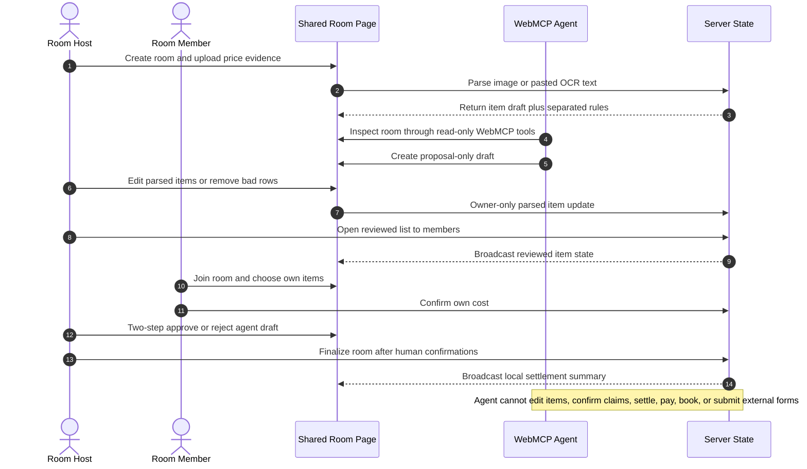
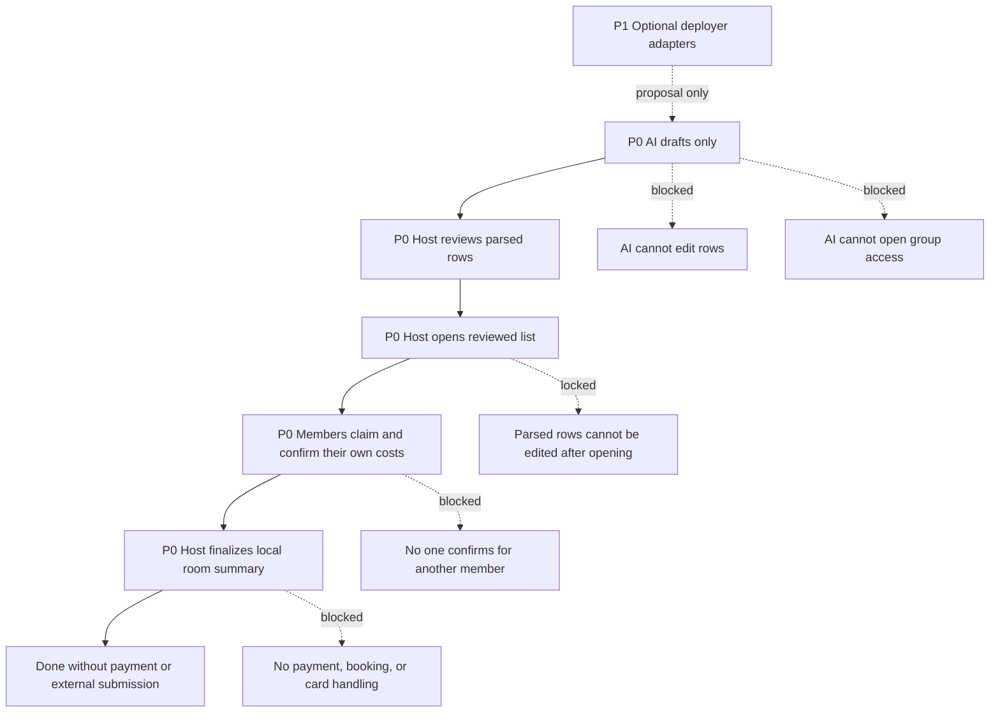

# Shared Room MCP

Shared Room MCP is a forkable WebMCP template designed for social coordination before payment or commitment. It creates a shared web environment where humans and agents collaborate in real time.

The app is English-first for judging and demo review. A Chinese UI dictionary remains available for local use, but the default page language, initial HTML, README, and submission packet are English.

Core claim: we solve the agent overreach problem through strict architectural boundaries, not fragile system prompts. AI contextually inspects and drafts; humans hold the final confirmation.

Operating inside the browser sidebar, an agent calls page-local WebMCP tools, inspects structured room state, and places proposal drafts directly onto the web page. The agent handles context gathering and repetitive draft work, while execution, settlement, payment, booking submission, and final commitment remain behind human confirmation.

The intended loop is WebMCP plus Codex, not a public mutation API. Codex can inspect the room, compare parsed evidence against the current labels, and create a `semantic_repair_draft` when field meaning drifts, for example when quantity columns, subtotal columns, size columns, or add-on notes are confused with item prices. That repair stays as JSON in the room for host review. The app does not silently apply the repair, settle money, submit a booking, or sync an external platform.

## Why This Fits WebMCP

Most social group coordination happens in temporary chats on LINE, Discord, Instagram, Threads, Facebook groups, Reddit, or local community channels. These flows rarely have stable vendor APIs or structured menu data. The user usually has only a price-list photo, receipt, checkout screenshot, public post screenshot, or local OCR text.

WebMCP is a good fit because the agent can enter the same browser room, inspect the current shared state through page-local tools, identify task conflicts, review OCR quality, read formula boundaries, and suggest the next human action without scraping the UI or taking over settlement.

## Core Product Boundary

This is not a vendor ordering app and does not require store integration. It is a generalized group room where humans upload price evidence, confirm personal claims, and settle shared or personal costs.

Provider adapters are optional and bounded:

- Local OCR text and deterministic parsing run first.
- Gemini or OpenAI support is only an example OCR/schema repair adapter.
- The core WebMCP workflow must work without any paid API key.
- AI cannot calculate money, assign claimants, change formulas, override task routing, settle disputes, or write payment data.
- WebMCP is the primary agent integration; external model APIs are not required for the agent workflow.

## Open Source Tool-Layer Positioning

This repository is intended to be a clean, forkable WebMCP tool layer. The project does not sell API access, resell model credits, require vendor ordering integrations, or require a fixed OCR provider.

Deployment owners can keep the default no-key manual/local-OCR workflow, remove the provider adapters, or replace them with their own OCR, vision, browser, commerce, spreadsheet, or private-community integrations. The stable part is the WebMCP contract surface and deterministic room state, not any paid API.

External developers should be able to fork the template, reuse the WebMCP tool contracts, and plug in their own adapters without asking for access to a central service. The intended extension surface is open-source code and documented tool boundaries, not an unrestricted public mutation API. High-risk actions such as booking submission, payment, account access, claims, and settlement should stay behind explicit human confirmation.

## Future Extension Modules

The group split room is the first reference module, not the only possible use case. The primary extension path should stay close to multi-person, pre-payment, or pre-commitment coordination where agent-readable state, audit, and human confirmation matter.

Core extension examples:

- Activity signup draft: collect attendee names, ticket classes, dietary notes, and prepare a registration proposal.
- Community purchase comparison: summarize options, threshold rules, and member interest before anyone pays.
- Maintenance or warranty request draft: organize receipt text, product model, photos, and contact fields for human review.
- Private community task coordination: turn chat decisions into structured tasks, claim states, and confirmation gates.
- Shared booking draft: collect time slots, member availability, room/court/package options, and prepare a proposal before anyone confirms.

Adjacent adapter forks:

- Auto repair appointment draft: collect car model, symptoms, preferred time, shop notes, and create a booking proposal for the owner to confirm.
- Nail, hair salon, clinic, or local service reservation draft: gather service type, preferred time, staff preference, notes, and prepare a click/form-fill proposal without submitting the appointment.

The hackathon demo should focus on the group room state machine. Adjacent booking/service examples should be mentioned only as forkable adapter patterns. In every extension, the agent may inspect state and prepare proposal-only drafts. The human keeps control over submission, payment, legal commitment, account access, and final confirmation.

Repository slug: `shared-room-mcp`.

## Commercial Extension Model

The open-source core is the WebMCP room template: task routing, structured room state, formula boundaries, audit gates, and agent-readable tools. Commercialization should happen through replaceable adapters, not through hard-coded platform lock-in.

Potential adapter categories:

- Booking adapters for auto repair shops, salons, clinics, local services, and venue reservations.
- Commerce adapters for product catalogs, group-buy thresholds, inventory checks, discount rules, and checkout handoff.
- Community adapters for LINE, Discord, Telegram, forums, and private membership spaces.
- Trust adapters for whitelist checks, short-lived invite validation, audit logs, and organization policy gates.
- Provider adapters for OCR, vision, translation, summarization, and schema repair.

This keeps the template useful for developers and safer for users: the project can support future business workflows while leaving payment execution, final booking submission, credit-card handling, and regulated financial commitments to the appropriate partner systems and explicit human confirmation.

## WebMCP Tools

The browser page registers tools with `document.modelContext.registerTool()` when WebMCP is available.

Implemented tools:

- `inspect_room`
- `get_task_router`
- `get_claim_audit`
- `get_formula_contract`
- `get_trust_layer_contract`
- `suggest_next_actions`
- `create_action_proposal`

The `suggest_next_actions` tool is the main agent workflow entrypoint. It returns current blockers, human-review requirements, formula boundaries, and forbidden actions. It cannot mutate room state and cannot calculate new money values.

The `create_action_proposal` tool is proposal-only. It can store a bounded JSON draft in `room.agentProposals[]` for the room owner, with status `pending_host_confirmation`. Supported draft types include claim review, missing confirmation, evidence review, task routing review, booking or service drafts, activity signup drafts, and `semantic_repair_draft` for Codex-proposed field or label repairs. Owner review uses an inline two-step confirmation before marking a draft accepted or rejected. Acceptance does not automatically change orders, claims, formulas, task routing, settlement, payment data, Google Sheets, bookings, or external systems.

## Priority And Atomic Boundaries

The UI hides most engineering language, but the repository documents the safety model explicitly for judges and developers. The core rule is atomic and one-way: AI can inspect and draft, the host reviews parsed rows, the host opens the reviewed list to the group, members claim their own costs, and only then can the host settle. Later steps may block or request review, but they cannot silently rewrite earlier decisions.

| priority | boundary | required behavior | blocked behavior |
|---|---|---|---|
| P0 | AI draft boundary | Agent stores proposal-only JSON for host review | Agent cannot edit items, open the list, confirm claims, or settle |
| P0 | Host review boundary | Host fixes or removes parsed rows before group access | Members cannot choose items before the host opens the reviewed list |
| P0 | Group access boundary | Host explicitly opens the reviewed list | Parsed item editing is locked after opening |
| P0 | Member claim boundary | Each member confirms only their own costs | Agent and host cannot impersonate member confirmations |
| P0 | Final decision boundary | Host settles after human confirmations | No payment, booking, external form submission, or card handling |
| P1 | Adapter boundary | Optional deployer-owned OCR, Sheets, booking, or trust adapters | Core demo must not require paid keys or vendor lock-in |

The UI and API intentionally expose six fixed module boundaries. Each module passes a contract forward. Downstream modules may mark review risk, but they cannot rewrite upstream module decisions. This prevents agent drift.

| module | fixed boundary | forbidden drift |
|---|---|---|
| Task Router | Selects or infers the scenario branch | AI cannot silently override the selected task |
| Evidence / OCR | Extracts price candidates from image or local OCR text | OCR cannot calculate totals or assign cost owners |
| Formula Engine | Runs deterministic local math through `formulaResults` | Sheets, external AI, Notion, and browser scraping cannot calculate money |
| AI Repair Gate | Repairs OCR/schema only when local confidence is insufficient | AI cannot settle disputes, assign claims, or change formulas |
| Claim Audit | Tracks shared candidates and extra personal claims | Agent cannot confirm claims on behalf of humans |
| Agent Drift Guard | Exposes read-only WebMCP tools plus draft-only proposal creation | Agent cannot mutate final room state, finalize claims, or write payment data |

## Task And Formula Matrix

The matrix below describes supported room branches and their current safe calculation boundary. It is not a claim that every advanced commercial formula is fully automated. P1 rules such as hourly rates, deposits, shipping allocation, and tier discounts are intentionally held behind manual review until the deployment owner hardens those inputs.

| task module | scenario | evidence | deterministic formula | AI repair trigger |
|---|---|---|---|---|
| `group_buy` | Community group buy, free-shipping threshold, bulk discount | Public post, price table, screenshot, local OCR | Same-item merge, participant subtotal, grand total, threshold remaining, extra personal claim | Missing item-price pairs, ambiguous tier rules, duplicated variants |
| `drink_order` | Office or community drink order | Menu photo, drink screenshot, local OCR | Item subtotal, sweetness/ice/addon delta, extra personal claim, minimum order threshold | Size-column drift, addon section ambiguity, same-name multi-price issue |
| `restaurant_split` | Meal bill or receipt split | Menu, receipt, checkout screenshot | Personal items, shared candidate average, extra personal claim, service-fee input in P1 | Tax/service lines mixed with items, item-price mismatch |
| `ktv_room` | KTV room, minimum spend, headcount fee | Room price table, minimum-spend notice, drink list | Room fee sharing, per-person minimum in P1, personal drinks | Time-slot or package boundary ambiguity |
| `sports_venue` | Court fee, venue booking, equipment rental | Venue rate table, time-slot table, rental list | Venue fee sharing, time-rate input in P1, equipment subtotal | Cross-column time rates, venue and equipment mixed in one image |
| `ticket_activity` | Tickets, workshops, activity signup | Activity post, ticket table, signup screenshot | Headcount times ticket price, group threshold in P1, group discount in P1 | Early-bird tiers or ticket classes are unclear |
| `rental_share` | Shared rental, deposit, equipment | Rental table, deposit notice | Rental fee sharing, personal rental subtotal, deposit marked but excluded by default | Deposit and fee ambiguity, unclear time unit |
| `generic_split` | Any temporary shared expense | Receipt, price screenshot, manual OCR | Grand total, average split, personal items | Low classification confidence or missing fields |

## Mermaid Overview

## Permission And Review Order

| role | can inspect | can draft suggestions | can edit parsed items | can edit own claims | can approve drafts | can settle |
|---|---:|---:|---:|---:|---:|---:|
| Anonymous viewer | yes | no | no | no | no | no |
| WebMCP agent | yes | proposal only | no | no | no | no |
| Room member | yes | no | no | own claims only | no | no |
| Room host | yes | yes | before member confirmation | own claims only | two-step human review | yes |
| Server | validates | stores bounded drafts | enforces owner gate | enforces self-claim gate | records review marker | executes local settlement state |

The fixed order is AI/OCR draft first, host review second, group access third, member confirmation fourth, and final settlement last. The host can remove bad OCR rows or fix names, prices, and categories before opening the list to members. After the host opens the list, parsed item editing is locked.





## Environment Variables

Required runtime variables:

```bash
HOST=0.0.0.0
PORT=3000
CORS_ORIGIN=
ROOM_TTL_HOURS=12
ROOM_PERSISTENCE=json
ROOM_STORE_PATH=data/rooms.json
MAX_IMAGE_MB=8
RATE_LIMIT_WINDOW_MS=60000
API_RATE_LIMIT_MAX=180
ROOM_CREATE_RATE_LIMIT_MAX=20
MENU_PARSE_RATE_LIMIT_MAX=6
LOCAL_OCR_FIRST=true
LOCAL_OCR_MIN_ITEMS=3
LOCAL_OCR_MAX_CHARS=12000
TRUST_LAYER_SPREADSHEET_ID=replace_with_google_sheet_id_for_whitelist_audit_only
```

Optional AI repair variables:

```bash
AI_PROVIDER_ORDER=gemini,openai
GEMINI_API_KEY=
GOOGLE_API_KEY=
GOOGLE_GENERATIVE_AI_API_KEY=
GOOGLE_GEMINI_API_KEY=
GEMINI_KEY=
GEMINI_MODEL=gemini-2.5-flash
GEMINI_MODEL_FALLBACKS=gemini-2.5-flash-lite,gemini-flash-latest
GEMINI_RETRY_ATTEMPTS=2
GEMINI_TIMEOUT_MS=25000
OPENAI_API_KEY=
OPENAI_MODEL=gpt-5.4-mini
OPENAI_MODEL_FALLBACKS=
OPENAI_TIMEOUT_MS=35000
OPENAI_MAX_OUTPUT_TOKENS=16000
OPENAI_IMAGE_DETAIL=high
```

Do not commit API keys. Set secrets only in Zeabur environment variables or the hosting provider secret manager.

Runtime requires Node.js `>=20.9.0` because the image normalization pipeline uses `sharp@0.35.x`.

## Deployment Configuration Guide

The repository provides configuration names only. Each project organizer changes values in the deployment platform, not in source code. Paid provider keys are optional adapters, not part of the required WebMCP demo path.

| purpose | variable | where to replace | required |
|---|---|---|---|
| Server port | `PORT` | Zeabur service variables | yes |
| Same-origin or allowlisted Socket.IO origin | `CORS_ORIGIN` | Leave empty for same-origin Zeabur deployment; set only for a separate frontend domain | optional |
| Room JSON store | `ROOM_STORE_PATH` | Zeabur service variables, use `/data/rooms.json` with a mounted volume | yes for restart-safe demo |
| Trust whitelist/audit sheet | `TRUST_LAYER_SPREADSHEET_ID` | Zeabur service variables | optional |
| Example Gemini OCR repair adapter | `GEMINI_API_KEY` or supported Google key alias | Zeabur service variables or provider secret manager | optional |
| Example OpenAI OCR repair adapter | `OPENAI_API_KEY` | Zeabur service variables or provider secret manager | optional |
| Public rate limit | `API_RATE_LIMIT_MAX`, `ROOM_CREATE_RATE_LIMIT_MAX`, `MENU_PARSE_RATE_LIMIT_MAX` | Zeabur service variables | yes |

Recommended open-source deployment order:

1. Copy `env.sample` variable names into Zeabur Variables.
2. Mount a Zeabur volume and set `ROOM_STORE_PATH=/data/rooms.json`.
3. Run the no-key flow first with manual input or local OCR text.
4. Add a provider key only if the deployment owner wants optional OCR/schema repair.
5. Restart the service and verify `/healthz` reports the expected provider and persistence flags without exposing secret values.

## Fast Review Sample

For judging or a quick local smoke test, open a new empty room and click `Load Sample Room`. This creates a small structured sample with shared and personal items, then adds a draft-only proposal for the host to review.

The sample path is intentionally no-key and no-upload:

- It does not call Gemini, OpenAI, Google Sheets, payment, booking, commerce, or social APIs.
- It does not overwrite a room that already has data.
- It creates a `pending_host_confirmation` proposal only.
- The host must still click the two-step review buttons before the draft status changes.
- Accepting the draft does not settle the bill, submit an external form, write payment data, or change formula rules.

## Local Development

```bash
npm install
npm run check
npm run audit:tasks
npm start
```

Open `http://localhost:3000`.

The app does not automatically load `.env`. If local AI image parsing is needed, export the key in the shell before starting the server. Use `env.sample` as the variable-name reference. Without an API key, the room still works with local OCR text when enough candidates are extracted.

## Zeabur Deployment

1. Connect the public GitHub repository to Zeabur.
2. Create a Node.js service.
3. Set the required environment variables listed above.
4. Keep AI provider keys empty for a clean WebMCP tool-layer demo, or add optional adapter keys only if OCR/schema repair should call external models.
5. Add a persistent volume and set `ROOM_STORE_PATH=/data/rooms.json` if rooms must survive service restarts.
6. Keep the public demo on one service instance when using JSON persistence.
7. Zeabur runs `npm install` and `npm start`.

Recommended public-demo limits:

```bash
RATE_LIMIT_WINDOW_MS=60000
API_RATE_LIMIT_MAX=180
ROOM_CREATE_RATE_LIMIT_MAX=20
MENU_PARSE_RATE_LIMIT_MAX=6
```

The expensive endpoint is image/OCR parsing, not WebMCP inspection. Keep `MENU_PARSE_RATE_LIMIT_MAX` low for public demos.

## Verification

```bash
npm run check
npm run audit:tasks
npm run stress:contracts -- --base-url http://127.0.0.1:3000 --rounds 20 --concurrency 4 --output-dir logs/runtime
```

The contract stress run covers 20 non-duplicate Traditional Chinese and English scenarios, with 20 rounds per scenario. It checks room creation, local copied-text OCR parsing, stable task selection, proposal draft creation, and the human-confirmation boundary.

Expected audit state:

- task router contract ready
- evidence/OCR contract ready
- formula contract ready
- claim audit ready
- WebMCP tool surface ready
- Google Sheets trust-layer contract ready
- submission local package ready

## Demo Script

1. Open the live URL.
2. Confirm the UI defaults to English.
3. Click `Load Sample Room` to create a no-key demo room with structured items and a draft waiting for host review.
4. Ask the agent to call `inspect_room`.
5. Ask the agent to call `suggest_next_actions`.
6. Ask the agent to call `create_action_proposal` and show the proposal stays in host review.
7. Click `Approve Draft`, then show the inline second step `Confirm Human Approval`.
8. Add or claim one item manually to show human control.
9. Point out the six plain-language safety steps in the UI.
10. Show that the agent can inspect contracts and blockers but cannot calculate money externally, finalize settlement, or write payment data.
11. State that WebMCP tools are registered in the browser page with `document.modelContext.registerTool()`; the same-origin backend only supports the app data layer.
12. Briefly mention future proposal-only extensions for reservations, repair appointments, salon bookings, and other form-draft workflows.

## Compliance Notes

- No fake account scraping.
- No vendor API reverse engineering.
- No authenticated vendor cookies.
- No payment processing.
- No raw device fingerprinting.
- No raw OCR, images, raw device IDs, payment identifiers, or social account identifiers are written to Google Sheets.
- Google Sheets is only a short-lived hash whitelist and audit-log trust layer.

## Known MVP Limits

- Rooms use a local JSON store by default. On Zeabur, attach a volume and set `ROOM_STORE_PATH=/data/rooms.json`; otherwise platform filesystem resets can still clear runtime state.
- The JSON store is intended for a single-instance demo. Concurrent writes or horizontal scaling should move to Redis or PostgreSQL.
- Production scale should replace the JSON store with Redis or PostgreSQL.
- Room ownership is demo-grade and based on participant IDs, not a production login system. Production deployments should add signed sessions or account authentication.
- OCR quality depends on image clarity.
- Additional P1 formula controls are still needed for shipping split, hourly venue fee, room minimum, deposit include/exclude, and tier discounts.
