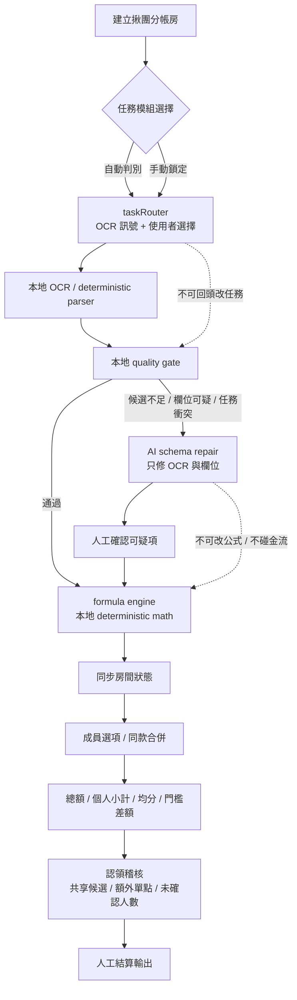
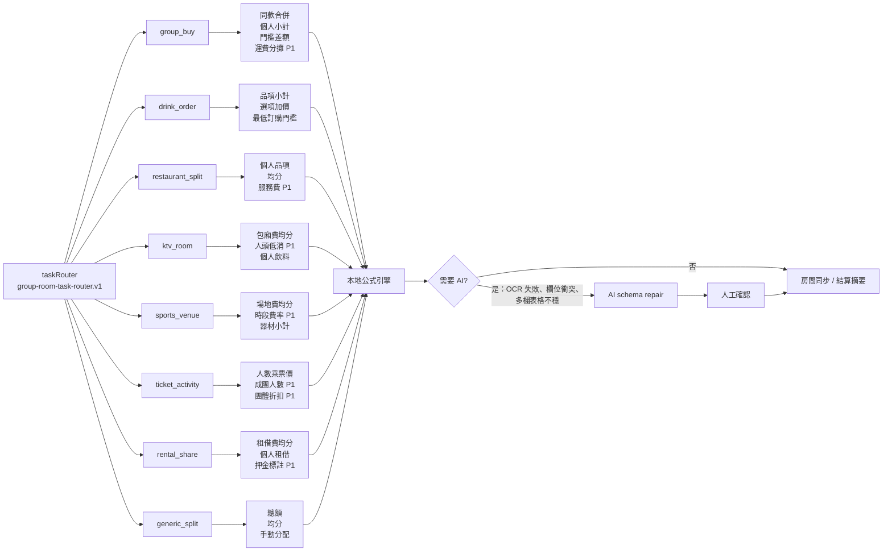
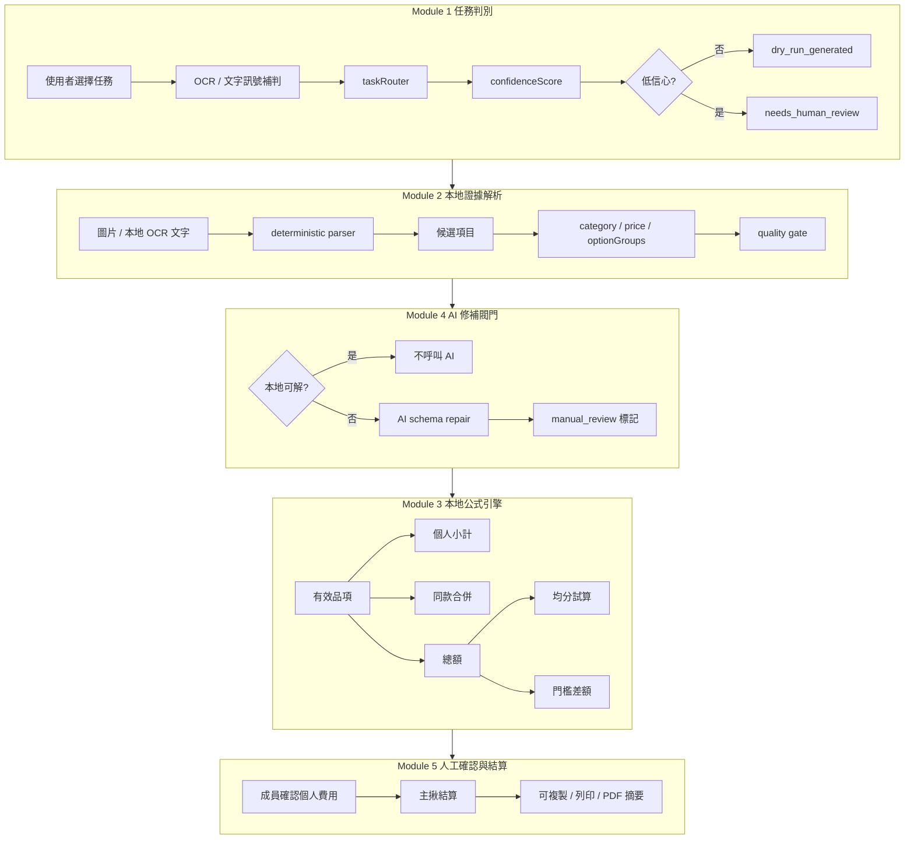
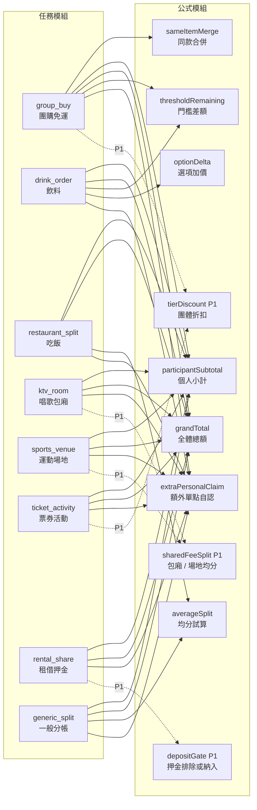
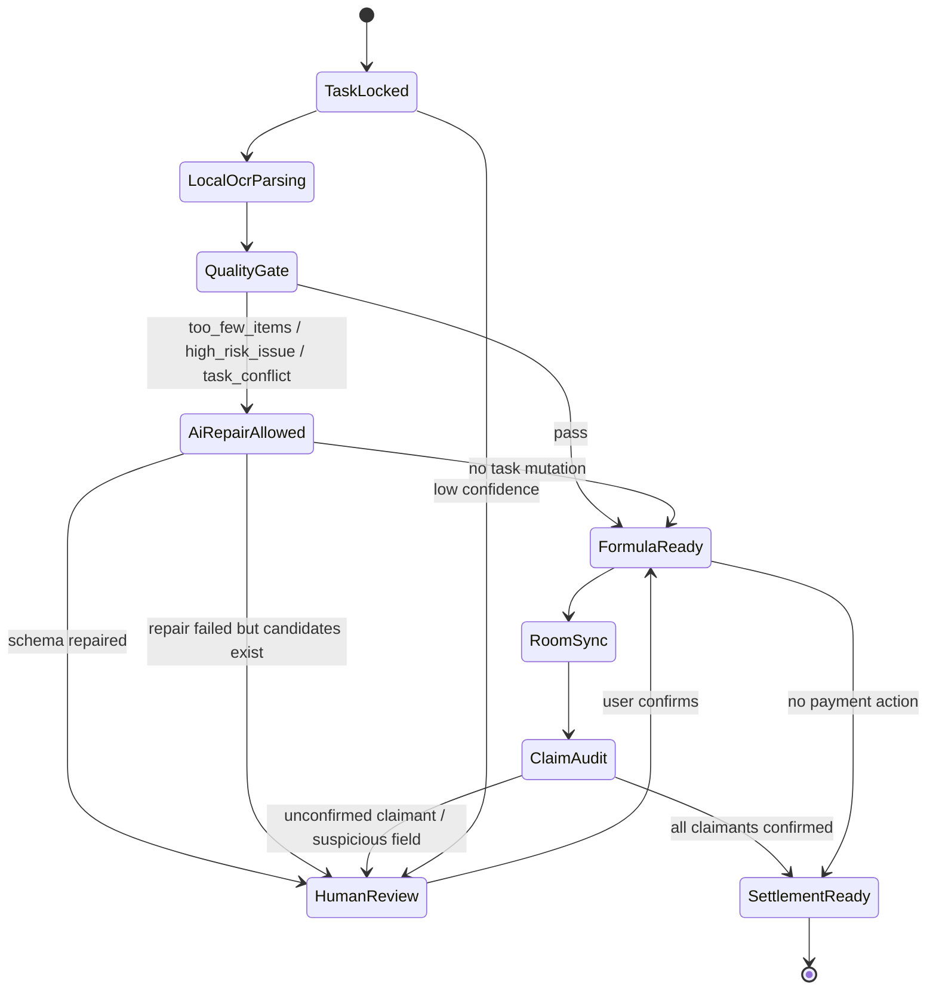

# 揪團分帳房 AI 價格證據解析

這個專案可部署到 Zeabur：主揪建立房間並上傳一張現場價格證據圖片，或貼上本地 OCR 文字。系統先用本地 deterministic parser 抽候選項目，再用 Gemini 或 OpenAI 做 schema repair；若 AI key 不存在或模型失敗，只要本地 OCR 候選足夠，仍可降級建立房間。團員使用同一個房間連結同步選擇項目、個人費用、均分試算與結算摘要。

產品定位不是店家點餐 App，而是免店家 API 的 generalized group split/order room。適用場景包含吃飯、飲料、KTV/唱歌包廂、運動場地、課程/活動報名、票券、低消、器材租借、多人套餐或包場方案。

## WebMCP Challenge 對齊

社群揪團通常發生在 LINE、Discord、Instagram、Threads、Facebook 社團、小紅書或臨時活動群組。這些情境沒有穩定店家 API，也很少有完整結構化資料；使用者手上常見的只有價目表照片、收據、結帳螢幕截圖、活動貼文截圖或手機本地 OCR 文字。這正是 WebMCP 適合處理的邊緣裝置協作需求：agent 可以進入同一個 web 房間讀取公開狀態、檢查價格證據、標出可疑欄位、協助建立分帳草稿，而人類負責確認模糊項目與成員歸屬。

Demo 應強調 agent + human collaboration，而不是單純 OCR：

- Agent 讀取房間狀態後，指出 OCR/AI 解析可疑欄位，例如同名多價、低消/服務費、包廂時數、器材租借或票券項目。
- Agent 依目前成員與已選項目提出均分或個人費用草稿，人類再確認每個人實際負擔。
- Agent 可根據房間總額和同款合併需求提示還差多少免運/低消、誰跟誰買同款、是否值得補一件達成滿額。
- Agent 在價格證據與房間明細不一致時提醒主揪，不直接替人類做不可逆結算。
- 沒有 API key 或雲端模型失敗時，房間仍可用本地 OCR 候選項目開啟，讓社群活動不被外部服務綁死。

## 任務模組、公式與 AI 單向閥門

系統先判別任務模組，再進入本地 OCR、公式引擎、AI 修補與人工確認。這些步驟是原子性單向閥門：下游可以標記上游低信心，但不能回頭改寫上游分類；AI 只能修補 OCR/schema，不決定公式、不碰金流、不改任務模組。

第 1 線 `taskRouterContract` 是任務路由的獨立輸出，不混公式、不混認領、不混外部白名單。房間 API 會回傳：

```text
contractVersion
fixedTaxonomyVersion
supportedTaskTypes
selectedTaskType
inferredTaskType
taskType
confidenceScore
confidenceReason
reviewStatus
riskPolicy
thresholdKind
splitMode
evidenceStrength
hasTaskConflict
conflictTaskType
lockedByUser
aiRepairAllowed
aiRepairScope
forbiddenAiActions
```

第 2 線 `evidenceContract` 是價格證據與 OCR 的獨立輸出，不混任務路由、不混分帳公式、不寫 Google Sheets。房間 API 會回傳：

```text
contractVersion
evidenceLine
localFirst
localOcr
imageInput
acceptedEvidenceSources
forbiddenEvidenceSources
deterministicParser
qualityGate
aiRepairGate
privacyBoundary
```

第 2 線規則：

- 接受使用者上傳的價格照片、收據、結帳截圖、公開價格表截圖、活動貼文截圖與使用者提供的本地 OCR 文字。
- 禁止假帳號 scraping、店家 API 逆向、cookie/authenticated vendor session、付款帳號資料、原始裝置指紋與社群帳號識別。
- 本地 deterministic parser 先抽品名、價格、分類、區塊、規格與選項；`qualityGate` 決定是否進入 AI repair。
- AI 只允許 `ocr_schema_repair_only`，不可改任務、不可算錢、不可指定認領者、不可結算、不可宣稱證據絕對真實。
- OCR 文字與證據圖片不送 Google Sheets；Sheets 只存第 6 線白名單 hash 與稽核狀態。

第 3 線 `formulaContract` 是公式引擎的獨立輸出，只描述本地 deterministic math，不讓 AI 參與計算。房間 API 會回傳：

```text
contractVersion
formulaVersion
taskType
splitMode
thresholdKind
deterministicOnly
activeModules
pendingModules
modules
inputSources
outputFields
aiAllowed
forbiddenAiActions
```

目前 `activeModules` 包含 `participantSubtotal`、`sameItemMerge`、`grandTotal`、`averageSplit`、`optionDelta`、`extraPersonalClaim`。`pendingModules` 包含 `thresholdRemaining`、`sharedFeeSplit`、`depositGate`、`tierDiscount`，這些需要 P1 manual formula controls，不交給模型計算。

分帳金額不可交給 Google Sheets、Notion、外部 AI 或瀏覽器 scraping 計算。Google Sheets 只屬於第 6 線 trust layer，可存短效白名單與稽核狀態，不作為公式 runtime。

第 6 線 `webMcpToolSurface` 和 `trustLayerContract` 是 agent / trust layer 的獨立輸出。WebMCP 工具採 progressive enhancement；瀏覽器支援 `document.modelContext.registerTool()` 時，頁面會註冊 read-only tools：

```text
inspect_room
get_task_router
get_claim_audit
get_formula_contract
get_trust_layer_contract
suggest_next_actions
```

這些工具只讀目前頁面的房間狀態，不寫 Sheets、不改任務、不結算、不指定認領者。`suggest_next_actions` 讓 agent 依 task conflict、OCR quality、claim audit、formula boundary 產生下一步建議，但不計算新金額、不改房間。Google Sheets trust layer 使用 `TRUST_LAYER_SPREADSHEET_ID` 指定，tab 結構固定為：

```text
Whitelist
AuditLog
ToolSpec
```

Sheets 工具規格：

```text
check_whitelist
enroll_device
revoke_device
expire_whitelist_rows
```

`check_whitelist` 是 read-only；其他工具只能改短效白名單狀態或寫 AuditLog，`writes_money=false`。

| task module | 情境 | 需要證據 | 本地公式 | 何時需要 AI |
|---|---|---|---|---|
| `group_buy` | 社群團購、湊免運、滿額折扣 | 團購貼文、價格表、截圖、本地 OCR | 同款合併、個人小計、總額、門檻差額、額外單點自認、運費分攤 P1 | OCR 找不到品名價格、滿額規則模糊、同款規格疑似重複 |
| `drink_order` | 飲料揪團、辦公室飲料 | 菜單照、飲料截圖、本地 OCR | 品項小計、甜度/冰塊/加料價差、額外單點自認、最低訂購門檻 | 尺寸欄飄移、加料區無法歸屬、同名多價 |
| `restaurant_split` | 吃飯分帳、收據分攤 | 菜單、收據、結帳截圖 | 個人品項、共享均分、額外單點自認、服務費或低消手動欄位 P1 | 收據欄位混入稅/服務費、品項與價格對不齊 |
| `ktv_room` | 唱歌包廂、低消、人頭費 | 包廂價目表、低消公告、飲料單 | 包廂費均分、人頭低消、個人飲料、額外單點自認 | 時段/人數/方案邊界模糊 |
| `sports_venue` | 球場、場租、器材 | 場租表、時段表、租借價目 | 場地費均分、時段費率、器材個人小計 | 時段價格跨欄、場地與器材混在同圖 |
| `ticket_activity` | 票券、活動、課程報名 | 活動貼文、票價表、報名截圖 | 人數乘票價、成團人數、團體折扣 P1 | 早鳥/分級票種無法穩定抽取 |
| `rental_share` | 器材租借、押金、共享租用 | 租借表、押金公告 | 租借費均分、個人租借、小計；押金預設只標註不入總額 | 押金/費用混淆、時間單位不明 |
| `generic_split` | 任意臨時分帳 | 收據、價格截圖、手動 OCR | 總額、均分、個人項目 | 分類低信心或欄位不足 |

單向流程：

```text
task module
-> local OCR / deterministic parser
-> formula engine
-> AI schema repair only when local confidence is insufficient
-> human confirmation
-> claim audit
-> settlement output
```

Mermaid.js 完整模組總覽圖：



Mermaid.js 任務模組與公式總覽圖：



Mermaid.js 小模組細項圖：







MVP 公式只包含總額、個人小計、共享均分、額外單點自認、同款合併與門檻差額。P1 再補運費分攤、包廂時數、人頭低消、押金排除/納入切換、團體折扣。

外部審核後採用的 AI 觸發條件：

- 本地 OCR 候選少於 `LOCAL_OCR_MIN_ITEMS`。
- 本地 quality gate 有高風險問題，例如非結算文字誤入、同名多價、飲料價格離群、分類大量未知。
- 任務模組與 OCR 訊號衝突，例如使用者選 KTV，但證據全是票券或租借。
- 表格是多欄時段、早鳥/分級票、包廂級距、租借押金等結構，本地 parser 無法穩定對齊。

任務衝突 gate：

```text
selectedTaskType
inferredTaskType
hasTaskConflict
conflictTaskType
parseQuality.taskConflict
parseQuality.issues[type=task_conflict,severity=high]
```

若使用者手動鎖定任務，但 OCR/品項訊號指向另一個明確任務，系統保留使用者鎖定的 `taskType`，同時把 `reviewStatus` 改成 `needs_human_review`，並在 quality gate 加入 `task_conflict` 高風險問題。AI 只能修補 OCR 與 schema，不能自行改掉任務模組。

不需要 AI 的公式：總額、個人小計、同款合併、共享均分、額外單點自認、門檻差額、選項加價、基本服務費百分比。這些都必須留在本地 deterministic calculator，不交給模型計算。

## 認領與確認稽核

`extraPersonalClaim` 不是獨立任務模組，而是所有任務都可使用的 claim mode。每個已選項目會被歸入兩種池：

| claim mode | UI 標籤 | 規則 |
|---|---|---|
| `shared_candidate` | 共享候選 | 包廂、場地、服務費、多人方案等可進共享均分，但仍需成員確認 |
| `personal_claim` | 額外單點自認 | 飲料、個人主餐、單人票券、個人租借等預設由選的人自己認領，不進共享均分 |

稽核欄位：

```text
claimAuditVersion
sharedCandidateTotal
personalClaimTotal
claimedOrderCount
claimLedgerCount
pendingClaimCount
claimStateCounts
claimLedger
unconfirmedParticipantCount
unconfirmedParticipants
settlementReady
rules
```

`claimLedger` 每筆欄位：

```text
claim_id
item_id
item_name
claimer_id
claimer_name
mode
cost_pool
qty
unit_price
subtotal
option_signature
verifiers
approvals
state
updated_at
```

狀態轉移：

```text
item selected
-> claim mode assigned deterministically
-> participant confirms personal total
-> claim audit checks unconfirmed participants and suspicious fields
-> organizer settlement
```

AI 禁止事項：

- 不可指定誰應該認領某個費用。
- 不可把個人單點改成共享均分。
- 不可繞過成員確認直接結算。
- 不可仲裁爭議或宣稱某張證據絕對真實。

## Google Sheets 短效白名單 P1

Google Sheets 適合放輕量信任層，不適合放金流或敏感指紋。建議只存短效 whitelist row：

```text
room_id
invite_code_hash
device_id_hash
display_name
role
status
expires_at
created_at
last_seen_at
notes
```

裝置識別應使用前端產生的一次性隨機 `deviceId`，例如 `crypto.randomUUID()`，送出前先 hash；不要使用 canvas、字型、瀏覽器外掛、硬體資訊或跨站追蹤式 fingerprint。MCP 工具只需要 `check_whitelist(roomId, deviceHash)`、`enroll_device(roomId, inviteCodeHash, deviceHash, displayName)`、`revoke_device(roomId, deviceHash)`。過期列由排程或 MCP 工具標成 `EXPIRED`，不作為付款、身份實名或不可抵賴證據。

隱私約束：

- Google Sheets 只存 hash、角色、狀態與到期時間，不存原始 device id、付款資訊、身分證件或社群帳號。
- 照片進後端後只保留壓縮後價格證據圖；正式營運前應明確去除 EXIF/GPS metadata。
- 到期白名單列只可用於拒絕後續進房，不可用於追蹤跨房行為。
- `REVOKED`、`EXPIRED`、`PENDING`、`ACTIVE` 必須是明確狀態，MCP 不應用模糊推論放行。

## 功能

- 價格證據圖片或本地 OCR 文字解析成固定欄位：項目名稱、單價、類別、規格、我的數量、全體數量、小計。
- 一次只上傳一張價格證據圖片，避免多頁分流造成等待與操作卡頓。
- 上傳流程採三段式：選擇圖片後先預覽，再按確定上傳；可按取消上傳清掉待上傳圖片。
- 後端會顯示壓縮後完整證據圖在項目頁面頂端，支援拖移、滾輪縮放與雙指縮放。
- 項目頁面頂端的壓縮證據圖可收合，也可下載保存。
- AI 解析已瘦身為項目、價格、類別、規格與可選選項；前端以完整壓縮證據圖為準，不做品項裁切縮圖。
- 本地 quality gate 會標出項目過少、非結算文字誤入、飲料價格離群、同名多價未收斂、分類過多未知、飲料缺尺寸/加料選項等問題。
- AI provider 預設順序為 `gemini,openai`，Gemini 成功時不會呼叫 OpenAI。
- AI 會判斷一般項目、飲料單或混合項目；發起者可切換自動、一般項目、飲料單。
- 飲料單才啟用甜度與冰塊選項；一般項目不顯示飲料店功能。
- 同一房間只解析一次圖片；已有價格證據時後端拒絕重複解析。
- Socket.IO 即時同步多人選項。
- 每個成員各自記錄數量，後端彙總全體總金額。
- 內建 share calculator：顯示全體總金額、依目前成員數均分試算、每人明細與項目統計。
- 內建門檻試算：可輸入免運、低消或成團門檻，系統即時顯示已達標或還差多少。
- 同款合併需求：項目統計會顯示總份數與共同需求成員，主揪可直接看出誰跟誰買一樣。
- 每個成員可確認個人費用；確認後鎖住自己的數量，取消確認後才能修改。
- 發起者可結算房間；結算後鎖定項目與飲料選項，並輸出可複製、列印或另存 PDF 的分帳單。
- 可建立新房間產生新的隨機連結；清空房間只清資料，不會更換網址。
- 成員統計只顯示在線、有費用或已確認的成員，避免離線空單殘留。
- 不寫入資料庫，房間資料只存在服務記憶體，適合 Zeabur 輕量部署。

## 本機啟動

```bash
npm install
cp .env.example .env
npm run dev
```

程式不會自動讀取本機 `.env`。本機若要測試 AI 圖片解析，請自行用 shell 或啟動器把 Gemini key 匯入執行環境；沒有 API Key 時，房間與多人同步仍可啟動。本地 OCR 文字若能解析出至少 3 個候選項目，系統會用 deterministic parser 降級開房，不需要店家 API。

支援的 Gemini key 變數名：

```bash
GEMINI_API_KEY
GOOGLE_API_KEY
GOOGLE_GENERATIVE_AI_API_KEY
GOOGLE_GEMINI_API_KEY
GEMINI_KEY
```

OpenAI 備援使用：

```bash
OPENAI_API_KEY
```

## Zeabur 設定

1. 將專案推送到 GitHub。
2. 在 Zeabur 新增 GitHub Service，選擇此 repository。
3. 在 Variables 設定：

```bash
GEMINI_API_KEY=你的 Gemini API Key
GEMINI_MODEL=gemini-2.5-flash-lite
GEMINI_MODEL_FALLBACKS=
GEMINI_RETRY_ATTEMPTS=1
GEMINI_TIMEOUT_MS=25000
AI_PROVIDER_ORDER=gemini,openai
OPENAI_API_KEY=你的 OpenAI API Key
OPENAI_MODEL=gpt-5.4-mini
OPENAI_MODEL_FALLBACKS=
OPENAI_TIMEOUT_MS=35000
OPENAI_MAX_OUTPUT_TOKENS=16000
OPENAI_IMAGE_DETAIL=high
HOST=0.0.0.0
ROOM_TTL_HOURS=12
MAX_IMAGE_MB=8
IMAGE_MAX_DIMENSION=1400
IMAGE_JPEG_QUALITY=80
ITEM_THUMB_SIZE=160
RATE_LIMIT_WINDOW_MS=60000
API_RATE_LIMIT_MAX=180
ROOM_CREATE_RATE_LIMIT_MAX=20
MENU_PARSE_RATE_LIMIT_MAX=6
LOCAL_OCR_MAX_CHARS=12000
LOCAL_OCR_FIRST=true
LOCAL_OCR_MIN_ITEMS=3
TRUST_LAYER_SPREADSHEET_ID=你的 Google Sheets id
```

4. Zeabur 會執行 `npm install` 與 `npm start`。

## 重要限制

- 目前是免資料庫 MVP，Zeabur 重啟或換實例後房間會消失。
- 若要正式營運，下一步應加入 Redis 或 PostgreSQL 儲存房間、成員、分帳明細與解析結果。
- API Key 僅放在 Zeabur 環境變數，不要寫入程式碼或前端。
- WebMCP 是 agent 導入的主線；Gemini/OpenAI 只是 OCR repair fallback，不是 agent 協作的必要條件。
- 後端內建記憶體限流：全 API 預設每 IP 每分鐘 180 次，開房每分鐘 20 次，圖片/OCR 解析每分鐘 6 次。若正式公開導流，建議再加 Cloudflare 或 Zeabur 前層 WAF/CDN。
- 不使用假帳號、cookie 或逆向工程店家 API。合規證據來源應是使用者自行上傳的現場照片、收據、結帳螢幕、公開價格表截圖或本地 OCR 文字。
- 預設先用 `gemini-2.5-flash-lite`；只有 Gemini 出現 429、5xx 或 timeout 等可備援錯誤時，才切換 OpenAI。
- OpenAI 預設備援模型為 `gpt-5.4-mini`。若要更便宜可改 `OPENAI_MODEL=gpt-5.4-nano`，但複雜飲料尺寸與加料判斷可能較不穩。
- 後端會先把上傳圖片轉成壓縮 JPEG 並限制最大尺寸，再送 Gemini；建議解析圖使用 1400px / JPEG 80，避免小字在壓縮後遺失。前端仍只顯示一張壓縮後主證據圖，避免裁切縮圖拖慢頁面。
- 純文字飲料價目表、KTV 價目表、運動場地費率或票券清單不會硬切成商品圖；系統只保留可結算項目的結構化欄位。
- 目前清空房間沒有管理權限控管，正式營運前應增加主揪管理碼。
