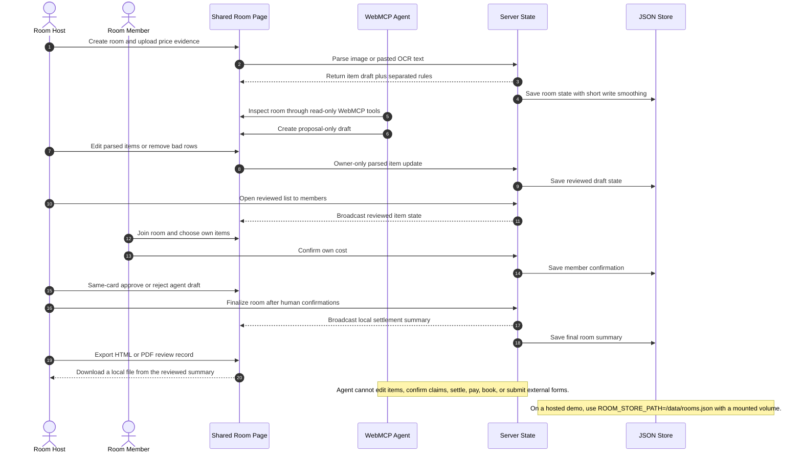
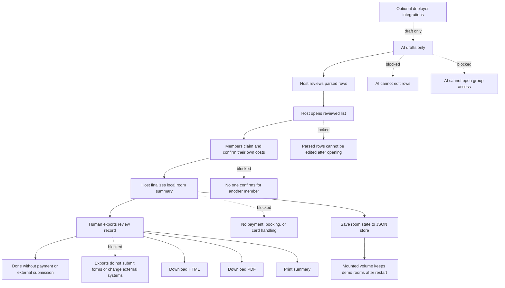

# Shared Room MCP

Shared Room MCP is an open-source trust boundary layer for the agent-native web. It gives people and AI assistants one shared page where agents can prepare real-world work, while humans keep final authority over commitments.

Live demo: https://shared-room-mcp-next.zeabur.app/

The app is English-first for judging and demo review. A Chinese UI dictionary remains available for local use, but the default page language, initial HTML, README, and submission packet are English.

Core claim: AI prepares the work. Humans approve the commitment. The assistant can read the room, spot missing details, and prepare structured drafts. The host and members still confirm what is true before any final action.

Language boundary: WebMCP tool names, schemas, descriptions, and JSON keys stay in English so the browser/sidebar agent receives a stable tool contract. User-provided evidence keeps its original language, so a Chinese group-buy post can still produce Chinese item names in the room.

In the browser sidebar, the assistant uses WebMCP tools from the page itself. It can inspect the room and place draft suggestions on the page. It cannot finish a split, submit a booking, make a payment, approve regulated purchases, post publicly, or confirm for another person.

The intended loop is WebMCP plus Codex, not a public write API. Codex can inspect the room, compare the price evidence against the current list, and create a field-fix draft when a price list is read incorrectly, for example when quantity, subtotal, size, or add-on notes are confused with item prices. That draft waits for host review. The app does not silently apply it, settle money, submit a booking, or sync an external platform.

## Why This Fits WebMCP

Many real-world commitments now start from messy web or social context: chat threads, creator posts, price images, service forms, booking pages, campaign notes, receipts, or copied text. These flows rarely have stable APIs or clean data. The user often has only a screenshot, a public post, a partial form, or a conversation.

WebMCP is a good fit because the assistant can enter the same browser room as the user, read the current state through page tools, find missing confirmations, and prepare the next action without scraping the screen or taking over the final decision.

## How We Checked It

The demo is not only a single happy-path recording. Before submission, the room flow was repeated locally and against deployed versions of the app.

The full check summary is in [`docs/testing/VALIDATION_EVIDENCE.md`](docs/testing/VALIDATION_EVIDENCE.md).

| check | result | what was checked |
|---|---:|---|
| Main room flow | 400/400 passed | 20 Chinese and English scenarios repeated 20 times each |
| Opening the list to members | 80/80 passed | members cannot claim items until the host opens the reviewed list |
| Save queue follow-up | 20/20 passed | host-review flow still works after the save queue change |
| Short burst of room creation | 25/25 saved | simultaneous room creates were present in the saved JSON file |
| Split-language scenarios | 240/240 passed | Chinese and English cases stay separated and still end in host review |
| Host-only draft review | 200/200 denied for non-hosts | non-host users cannot create or approve host drafts |
| Load Sample Room | 120/120 passed | sample data stays as a draft and does not settle, pay, or call outside services |
| Current Zeabur production flow | PASS | hosted health, WebMCP, member-confirmation, finalized summary, and HTML/PDF export flow |
| Same-tab room switch | 2/2 passed | a new room gets clean controls, and late updates from the old room are ignored |

These checks show that the assistant workflow is repeatable and no-key by default. They are not a claim of production-scale database capacity. The default JSON save layer is for a single demo service; production traffic should use Redis or PostgreSQL.

## Core Product Boundary

This is not a vendor ordering app and does not require store integration. It is a shared action-preparation room where humans provide evidence, review structured drafts, confirm their own claims, and keep control of the final commitment.

AI provider keys are optional:

- Pasted text and local rule-based parsing run first.
- Gemini or OpenAI support is only an optional image/text repair example.
- The core WebMCP workflow must work without any paid API key.
- AI cannot decide who owes money, confirm for people, change the rules, settle disputes, or write payment data.
- WebMCP is the primary agent integration; external model APIs are not required for the agent workflow.

## Open Source Tool-Layer Positioning

This repository is intended to be a clean, forkable WebMCP starter project. It does not sell API access, resell model credits, require store integration, or require a fixed OCR provider.

Deployment owners can keep the default no-key flow, remove the optional provider code, or replace it with their own OCR, vision, browser, commerce, spreadsheet, or private-community integrations. The stable part is the shared room workflow and the WebMCP tools, not any paid API.

External developers should be able to fork the template and plug in their own integrations without asking for access to a central service. High-risk actions such as booking submission, payment, account access, claims, and settlement should stay behind explicit human confirmation.

Reviewed rooms can export a local HTML or PDF review record. Exporting a record does not submit a form, call a payment provider, change Google Sheets, or write to an external service.

## Future Extension Modules

The group cost room is the first reference use case, not the product boundary. The project is best for workflows where the assistant can prepare a draft and people still need to review it before an irreversible action.

Core extension examples:

- Activity signup draft: collect attendee names, ticket classes, dietary notes, and prepare a registration proposal.
- Community purchase comparison: summarize options, threshold rules, and member interest before anyone pays.
- Maintenance or warranty request draft: organize receipt text, product model, photos, and contact fields for human review.
- Private community task coordination: turn chat decisions into tasks, owners, and review steps.
- Shared booking draft: collect time slots, member availability, room/court/package options, and prepare a proposal before anyone confirms.

Possible future integrations:

- Auto repair appointment draft: collect car model, symptoms, preferred time, shop notes, and create a booking proposal for the owner to confirm.
- Nail, hair salon, clinic, or local service reservation draft: gather service type, preferred time, staff preference, notes, and prepare a click/form-fill proposal without submitting the appointment.

The hackathon demo should focus on the group room workflow. Booking and service examples are future fork ideas. In every extension, the assistant may inspect state and prepare drafts. The human keeps control over submission, payment, legal commitment, account access, and final confirmation.

Repository slug: `shared-room-mcp`.

## Commercial Extension Model

The open-source core is the WebMCP room template: room types, shared state, local math, review steps, and assistant-readable tools. Commercialization should happen through replaceable integrations, not hard-coded platform lock-in.

Potential integration categories:

- Booking integrations for auto repair shops, salons, clinics, local services, and venue reservations.
- Commerce integrations for product catalogs, group-buy thresholds, inventory checks, discount rules, and checkout handoff.
- Community integrations for LINE, Discord, Telegram, forums, and private membership spaces.
- Trust integrations for whitelist checks, short-lived invite validation, review logs, and organization policy checks.
- Provider integrations for OCR, vision, translation, summarization, and field repair.

This keeps the template useful for developers and safer for users: the project can support future business workflows while leaving payment, final booking submission, credit-card handling, and regulated financial commitments to the appropriate partner systems and explicit human confirmation.

## WebMCP Tools

The browser page registers tools with `document.modelContext.registerTool()` when WebMCP is available.

Implemented tools:

- `inspect_room`
- `get_task_router`
- `get_claim_audit`
- `get_formula_contract`
- `get_trust_layer_contract`
- `suggest_next_actions`
- `create_action_proposal`

The `suggest_next_actions` tool is the main way for the assistant to read the room and suggest what should happen next. It can point out missing reviews or confirmations. It cannot change the room and cannot invent new money values.

The `create_action_proposal` tool only creates a draft for the host. Supported drafts include claim review, missing confirmation, evidence review, room type review, booking or service drafts, activity signup drafts, and field-fix drafts when Codex notices a reading mistake. The page keeps only one pending draft per draft type, so the host sees one clear card for one decision. The host presses the same card button to arm and confirm the review. Accepting a draft does not automatically change orders, claims, calculation rules, settlement, payment data, Google Sheets, bookings, or external systems.

## Safety Flow

The UI uses plain language, and the code keeps the same order every time: AI prepares a draft, the host reviews the list, the host opens it to the group, members confirm their own costs, and only then can the host finalize the room summary. Later steps may stop and ask for review, but they cannot silently rewrite earlier decisions.

| step | what happens | what is blocked |
|---|---|---|
| Assistant prepares | AI stores a draft for host review | AI cannot edit items, open the list, confirm claims, or settle |
| Host reviews | Host fixes or removes parsed rows before group access | Members cannot choose items before the host opens the reviewed list |
| Host opens | Host explicitly opens the reviewed list | Parsed item editing is locked after opening |
| Members confirm | Each member confirms only their own costs | AI and host cannot confirm for someone else |
| Host finalizes | Host finalizes after human confirmations | No payment, booking, external form submission, or card handling |
| Optional integrations | Deployment owner may add OCR, Sheets, booking, or trust helpers | Core demo must not require paid keys or vendor lock-in |

The project has six fixed safety checks. Each check passes a limited result forward. Later checks may mark something for review, but they cannot silently rewrite earlier choices.

| safety check | job | what it cannot do |
|---|---|---|
| Choose the room type | Selects or infers the scenario | AI cannot silently switch the room type |
| Read the price evidence | Extracts item and price candidates from image or copied text | Price reading cannot calculate totals or assign cost owners |
| Calculate locally | Calculates totals inside the app | Sheets, external AI, Notion, and screen scraping cannot become the calculator |
| Repair unclear fields | Creates a review draft only when the input is unclear | AI cannot settle disputes, assign claims, or change calculation rules |
| Check confirmations | Tracks shared items and extra personal claims | AI cannot confirm claims on behalf of humans |
| Keep AI in draft mode | Exposes read tools plus draft creation | AI cannot finalize room state or write payment data |

## Supported Room Types

The table below describes the room types and what the app can safely calculate today. It is not a claim that every advanced business rule is fully automated. Rules such as hourly rates, deposits, shipping allocation, and tier discounts stay behind manual review until a deployment owner finishes and tests those inputs.

| room type | scenario | evidence | calculated today | needs review when |
|---|---|---|---|---|
| `group_buy` | Community group buy, free-shipping threshold, bulk discount | Public post, price table, screenshot, local OCR | Same-item merge, participant subtotal, grand total, threshold remaining, extra personal claim | Missing item-price pairs, ambiguous tier rules, duplicated variants |
| `drink_order` | Office or community drink order | Menu photo, drink screenshot, local OCR | Item subtotal, sweetness/ice/addon delta, extra personal claim, minimum order threshold | Size-column drift, addon section ambiguity, same-name multi-price issue |
| `restaurant_split` | Meal bill or receipt split | Menu, receipt, checkout screenshot | Personal items, shared candidate average, extra personal claim, service-fee input marked for manual review | Tax/service lines mixed with items, item-price mismatch |
| `ktv_room` | KTV room, minimum spend, headcount fee | Room price table, minimum-spend notice, drink list | Room fee sharing, per-person minimum marked for manual review, personal drinks | Time-slot or package boundary ambiguity |
| `sports_venue` | Court fee, venue booking, equipment rental | Venue rate table, time-slot table, rental list | Venue fee sharing, time-rate input marked for manual review, equipment subtotal | Cross-column time rates, venue and equipment mixed in one image |
| `ticket_activity` | Tickets, workshops, activity signup | Activity post, ticket table, signup screenshot | Headcount times ticket price, group threshold and group discount marked for manual review | Early-bird tiers or ticket classes are unclear |
| `rental_share` | Shared rental, deposit, equipment | Rental table, deposit notice | Rental fee sharing, personal rental subtotal, deposit marked but excluded by default | Deposit and fee ambiguity, unclear time unit |
| `generic_split` | Any temporary shared expense | Receipt, price screenshot, manual OCR | Grand total, average split, personal items | Low classification confidence or missing fields |

## Mermaid Overview

## Permission And Review Order

| role | can inspect | can draft suggestions | can edit parsed items | can edit own claims | can approve drafts | can settle |
|---|---:|---:|---:|---:|---:|---:|
| Anonymous viewer | yes | no | no | no | no | no |
| WebMCP agent | yes | proposal only | no | no | no | no |
| Room member | yes | no | no | own claims only | no | no |
| Room host | yes | yes | before member confirmation | own claims only | same-card human review | yes |
| Server | validates | stores limited drafts | checks room owner | checks each member only confirms themself | records review result | saves local room summary |

The fixed order is AI/OCR draft first, host review second, group access third, member confirmation fourth, and final settlement last. The host can remove bad OCR rows or fix names, prices, and categories before opening the list to members. After the host opens the list, parsed item editing is locked.





The detailed module, permission, state, and room-transition diagrams are in [`docs/ai-generated/2026Q3/shared_room_mermaid_module_design_20260831.md`](docs/ai-generated/2026Q3/shared_room_mermaid_module_design_20260831.md).

## Environment Variables

Required runtime variables:

```bash
HOST=0.0.0.0
PORT=3000
CORS_ORIGIN=
ROOM_TTL_HOURS=12
ROOM_PERSISTENCE=json
ROOM_STORE_PATH=data/rooms.json
ROOM_PERSIST_DEBOUNCE_MS=35
ROOM_PERSIST_JITTER_MS=120
MAX_IMAGE_MB=8
RATE_LIMIT_WINDOW_MS=60000
API_RATE_LIMIT_MAX=180
ROOM_CREATE_RATE_LIMIT_MAX=20
MENU_PARSE_RATE_LIMIT_MAX=30
LOCAL_OCR_FIRST=true
LOCAL_OCR_MIN_ITEMS=3
LOCAL_OCR_MAX_CHARS=12000
TRUST_LAYER_SPREADSHEET_ID=replace_with_google_sheet_id_for_whitelist_audit_only
```

Optional AI repair variables:

```bash
AI_PROVIDER_ORDER=gemini,openai
GEMINI_API_KEY=
GOOGLE_API_KEY=
GOOGLE_GENERATIVE_AI_API_KEY=
GOOGLE_GEMINI_API_KEY=
GEMINI_KEY=
GEMINI_MODEL=gemini-2.5-flash
GEMINI_MODEL_FALLBACKS=gemini-2.5-flash-lite,gemini-flash-latest
GEMINI_RETRY_ATTEMPTS=2
GEMINI_TIMEOUT_MS=25000
OPENAI_API_KEY=
OPENAI_MODEL=gpt-5.4-mini
OPENAI_MODEL_FALLBACKS=
OPENAI_TIMEOUT_MS=35000
OPENAI_MAX_OUTPUT_TOKENS=16000
OPENAI_IMAGE_DETAIL=high
```

Do not commit API keys. Set secrets only in the hosting provider's secret manager.

Runtime requires Node.js `>=20.9.0` because the image normalization pipeline uses `sharp@0.35.x`.

## Deployment Configuration Guide

The repository provides configuration names only. Each project organizer changes values in the deployment platform, not in source code. Paid provider keys are optional adapters, not part of the required WebMCP demo path.

| purpose | variable | where to replace | required |
|---|---|---|---|
| Server port | `PORT` | hosting service variables | yes |
| Same-origin or allowlisted Socket.IO origin | `CORS_ORIGIN` | leave empty for a same-origin deployment; set only for a separate frontend domain | optional |
| Room JSON store | `ROOM_STORE_PATH` | hosting service variables, use `/data/rooms.json` with a mounted volume | yes for restart-safe demo |
| Room save smoothing | `ROOM_PERSIST_DEBOUNCE_MS`, `ROOM_PERSIST_JITTER_MS` | hosting service variables; small millisecond values smooth short write bursts | optional |
| Trust whitelist/audit sheet | `TRUST_LAYER_SPREADSHEET_ID` | hosting service variables | optional |
| Example Gemini OCR repair adapter | `GEMINI_API_KEY` or supported Google key alias | provider secret manager | optional |
| Example OpenAI OCR repair adapter | `OPENAI_API_KEY` | provider secret manager | optional |
| Public rate limit | `API_RATE_LIMIT_MAX`, `ROOM_CREATE_RATE_LIMIT_MAX`, `MENU_PARSE_RATE_LIMIT_MAX` | hosting service variables | yes |

Recommended open-source deployment order:

1. Copy `env.sample` variable names into the hosting service variables.
2. Mount a persistent volume at `/data` and set `ROOM_STORE_PATH=/data/rooms.json`.
3. Run the no-key flow first with manual input or local OCR text.
4. Add a provider key only if the deployment owner wants optional OCR/schema repair.
5. Restart the service and verify `/healthz` reports the expected provider and persistence flags without exposing secret values.

## Fast Review Sample

For judging or a quick local smoke test, open a new empty room and click `Load Sample Room`. This creates a small structured sample with shared and personal items, then adds a draft-only proposal for the host to review.

The sample path is intentionally no-key and no-upload:

- It does not call Gemini, OpenAI, Google Sheets, payment, booking, commerce, or social APIs.
- It does not overwrite a room that already has data.
- It creates a draft that waits for host review.
- The host must still confirm the same draft card before the draft status changes.
- Accepting the draft does not settle the bill, submit an external form, write payment data, or change formula rules.

## Local Development

```bash
npm install
npm run check
npm run audit:tasks
npm start
```

Open `http://localhost:3000`.

The app does not automatically load `.env`. If local AI image parsing is needed, export the key in the shell before starting the server. Use `env.sample` as the variable-name reference. Without an API key, the room still works with local OCR text when enough candidates are extracted.

## Hosted Deployment

1. Connect the public GitHub repository to a Node.js hosting service. The live demo currently runs on Zeabur.
2. Create a Node.js service.
3. Set the required environment variables listed above.
4. Keep AI provider keys empty for a clean WebMCP tool-layer demo, or add optional adapter keys only if OCR/schema repair should call external models.
5. Add a persistent volume and set `ROOM_STORE_PATH=/data/rooms.json` if rooms must survive service restarts.
6. Keep the public demo on one service instance when using JSON persistence.
7. Use `npm install` as the install command and `npm start` as the start command.

Recommended public-demo limits:

```bash
RATE_LIMIT_WINDOW_MS=60000
API_RATE_LIMIT_MAX=180
ROOM_CREATE_RATE_LIMIT_MAX=20
MENU_PARSE_RATE_LIMIT_MAX=30
```

The expensive endpoint is image/OCR parsing, not WebMCP inspection. The public demo allows 30 parse requests per client per minute while retaining basic abuse protection.

## Verification

```bash
npm run check
npm run audit:tasks
npm run stress:contracts -- --base-url http://127.0.0.1:3000 --rounds 20 --concurrency 4 --output-dir logs/runtime
```

The repeated room-flow check covers 20 non-duplicate Traditional Chinese and English scenarios, with 20 rounds per scenario. It checks room creation, local copied-text OCR parsing, stable room-type selection, draft creation, and the final human approval rule.

Expected audit state:

- room type selection ready
- evidence/OCR review ready
- local calculation rules ready
- member confirmation checks ready
- WebMCP tools ready
- Google Sheets trust option ready
- submission local package ready

## Demo Script

The locked recording flow is:

1. Start on the live Shared Room page with the agent side panel visible.
2. Upload the prepared English `Community Workshop Signup` image through the visible file picker. Do not use `Load Sample Room` in the recording.
3. The agent reads the visible evidence, enters only the visible price lines, and calls `inspect_room`, `suggest_next_actions`, and `create_action_proposal`.
4. The agent moves the pointer to the single draft card and tells the host when to click. The host clicks the same card twice: first to mark it reviewed, then to confirm the green approval state.
5. The agent opens the same room in a second tab as `Jamie`, selects one item, and pauses. Jamie clicks the personal confirmation button once.
6. The agent immediately returns to the owner tab, verifies the member state, and pauses. The owner clicks `Owner Finalizes Summary` once.
7. The owner clicks `Download PDF`, then `Download HTML`. Both files must open successfully before the recording continues.
8. Open a new room, switch to Chinese, and upload the prepared `社區水果免運團購` image. The threshold and shipping lines must remain review context rather than purchasable items.
9. Repeat the same controlled loop quickly: agent prepares, the human approves on one card, a second member confirms their own item, and the owner finalizes.
10. Close by stating that payment, booking submission, and external account actions remain outside the exposed tool set.

Use this spoken line near the start:

"AI prepares the work directly on the page. Humans approve the commitment."

Use this closing line:

"WebMCP lets the agent handle the repetitive work on the page while people keep every commitment. The same pattern can support shared orders, registrations, bookings, and other collaborative tasks without exposing final payment or external submission as an agent tool."

The detailed timed runbook is in [`docs/submission/WEBMCP_SUBMISSION.md`](docs/submission/WEBMCP_SUBMISSION.md#locked-demo-runbook).

## Compliance Notes

- No fake account scraping.
- No vendor API reverse engineering.
- No authenticated vendor cookies.
- No payment processing.
- No raw device fingerprinting.
- No raw OCR, images, raw device IDs, payment identifiers, or social account identifiers are written to Google Sheets.
- Google Sheets is only a short-lived hash whitelist and audit-log trust layer.

## Known MVP Limits

- Room data is saved to a local JSON file by default. On a hosted service, attach a volume and set `ROOM_STORE_PATH=/data/rooms.json`; otherwise a platform restart can still clear room state.
- The current save layer is meant for one demo service instance. It smooths short write bursts by merging nearby changes and adding a small millisecond delay before saving, but a hard crash can still lose the latest tiny write window. Production traffic should move to Redis or PostgreSQL.
- Room ownership is demo-grade. Production deployments should add signed sessions or a real login system.
- OCR quality depends on image clarity.
- Advanced rules such as shipping split, hourly venue fee, room minimum, deposit include/exclude, and tier discounts still require manual review before a production owner hardens them.
