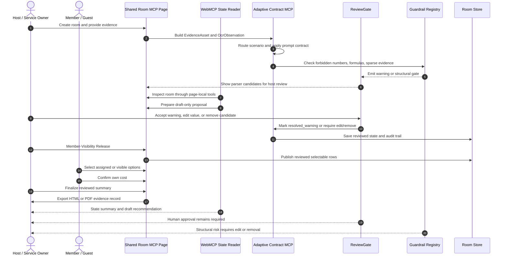
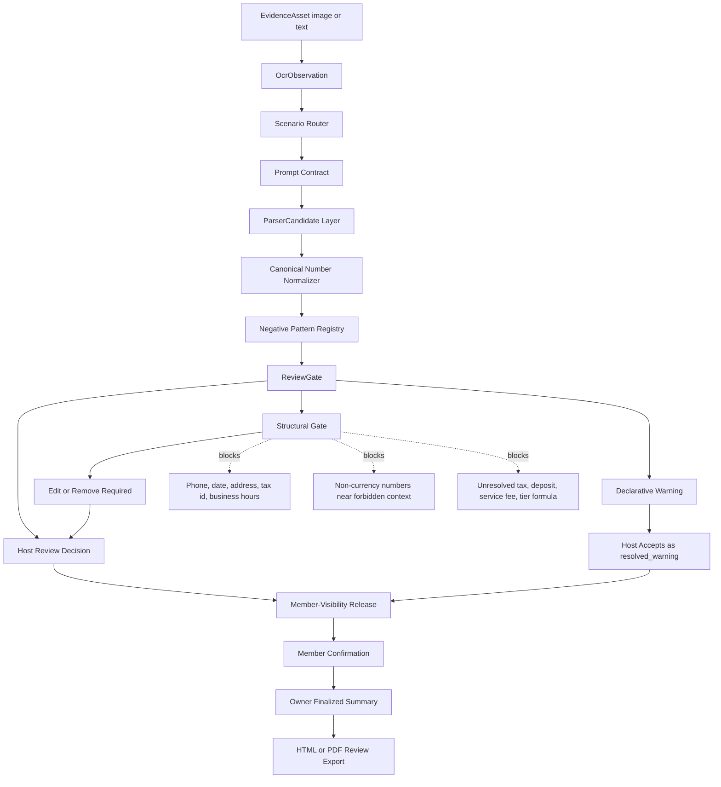

# Shared Room MCP

Powered by Adaptive Contract MCP.

Shared Room MCP is the reference application for Adaptive Contract MCP, an open-source trust boundary layer for form-based async state rooms on the agent-native web. It is not a chatroom, messaging app, payment gateway, or auto-booking agent. A host creates a single-direction private task from evidence, the assistant prepares structured review drafts, and invited members only act on their own assigned or selected part.

Live demo: https://shared-room-mcp-next.zeabur.app/

The app is English-first for judging and demo review. A Chinese UI dictionary remains available for local use, but the default page language, initial HTML, README, and submission packet are English.

Core claim: AI prepares the evidence review. Humans approve the commitment. The assistant can read the room, spot missing details, and prepare structured drafts. The host controls publication to members, and each member confirms only their own task/cost state.

Language boundary: WebMCP tool names, schemas, descriptions, and JSON keys stay in English so the browser/sidebar agent receives a stable tool contract. User-provided evidence keeps its original language, so a Chinese group-buy post can still produce Chinese item names in the room.

In the browser sidebar, the assistant uses WebMCP tools from the page itself. Here WebMCP means a page-local state reader and draft generator, not a browser agent that clicks or submits final actions for the user. It inspects the private room state and places draft suggestions on the page for human review.

The intended loop is WebMCP plus Codex as a private task-review layer. Codex can inspect the room, compare the price evidence against the current list, and create a field-fix draft when a price list is read incorrectly, for example when quantity, subtotal, size, or add-on notes are confused with item prices. That draft waits for host review before the member-facing task list changes.

The review layer uses Semantic Visual Anchors: each extracted field keeps its evidence snippet, logical image zone, detected type hint, and review-gate reason so the host can compare the candidate against the source context. Pixel-level crop and bounding-box overlays are reserved in the schema as a roadmap extension; they are not required for the current deterministic integration benchmark.

Semantic Visual Anchor Notice: this system currently implements semantic visual anchoring with hierarchical logical zones (`boundingZone`) paired with contextual snippets (`auditAnchor`). Pixel-level spatial boxes (`bbox`) and crop overlays are reserved protocol fields for a future visual review overlay.

## Why This Fits WebMCP

Many real-world commitments now start from messy evidence: creator posts, price images, service forms, booking pages, campaign notes, receipts, copied text, or screenshots. These flows rarely have stable APIs or clean data. The host often has only a screenshot, a public post, or a partial form.

WebMCP is a good fit because the assistant can enter the same private task room as the host, read the current state through page tools, find missing confirmations, and prepare the next review action from structured room state.

## How We Checked It

The demo is not only a single happy-path recording. Before submission, the room flow was repeated locally and against deployed versions of the app.

The full check summary is in [`docs/testing/VALIDATION_EVIDENCE.md`](docs/testing/VALIDATION_EVIDENCE.md).

| check | result | what was checked |
|---|---:|---|
| Main room flow | 400/400 passed | 20 Chinese and English scenarios repeated 20 times each |
| Member-Visibility Release | 80/80 passed | members cannot claim items until the host releases the reviewed list |
| Save queue follow-up | 20/20 passed | host-review flow still works after the save queue change |
| Short burst of room creation | 25/25 saved | simultaneous room creates were present in the saved JSON file |
| Split-language scenarios | 240/240 passed | Chinese and English cases stay separated and still end in host review |
| Host-only draft review | 200/200 denied for non-hosts | non-host users cannot create or approve host drafts |
| Load Sample Room | 120/120 passed | sample data stays as a draft and does not settle, pay, or call outside services |
| Current Zeabur production flow | PASS | hosted health, WebMCP, member-confirmation, finalized summary, and HTML/PDF export flow |
| Same-tab room switch | 2/2 passed | a new room gets clean controls, and late updates from the old room are ignored |
| Image oracle integration benchmark | 115/115 passed | deterministic image-plus-oracle-text contract test, not provider accuracy |

These checks show that the assistant workflow is repeatable and no-key by default. They are not a claim of production-scale database capacity. The default JSON save layer is for a single demo service; production traffic should use Redis or PostgreSQL.

## Core Product Boundary

This is a single-direction task room. The host provides evidence and performs the Member-Visibility Release after review; members select or confirm only their own part; final commitment stays behind the host/member review gates.

`Shared Room MCP` is the demo application and repository slug. `Adaptive Contract MCP` is the underlying contract, routing, prompt, guardrail, and HITL state-machine layer. The architecture name is used where the project discusses reusable scenario contracts, image-fixture oracles, enterprise submission gates, and anti-pollution review controls.

AI provider adapters are extension-only:

- Pasted text and local rule-based parsing run first.
- The core WebMCP workflow must work without any paid API key.
- Codex and the browser sidebar provide the intended LLM collaboration layer: visual review, evidence comparison, field-fix suggestions, and state guidance.
- WebMCP is the primary agent integration; external model APIs are not required for the agent workflow.
- Server-side Gemini/OpenAI adapters exist only as replaceable examples for deployment owners who explicitly choose external OCR/schema repair outside the core demo path.

## Open Source Tool-Layer Positioning

This repository is intended to be a clean, forkable WebMCP starter project. It does not sell API access, resell model credits, require store integration, or require a fixed OCR provider.

Deployment owners can keep the default no-key flow, remove the extension adapter code, or replace it with their own OCR, vision, browser, commerce, spreadsheet, or private-community integrations. The stable part is the shared room workflow and the WebMCP tools, not any paid API.

External developers should be able to fork the template and plug in their own integrations without asking for access to a central service. High-risk commitments stay behind explicit host/member confirmation.

Reviewed rooms can export a local HTML or PDF review record as evidence of the private room decision state.

## Future Extension Modules

The group cost room is the first reference use case, not the product boundary. The project is best for workflows where the assistant can prepare a draft and people still need to review it before an irreversible action.

Core extension examples:

- Activity signup draft: collect attendee names, ticket classes, dietary notes, and prepare a registration task proposal.
- Community purchase comparison: summarize options, threshold rules, and member interest before anyone pays.
- Maintenance or warranty request draft: organize receipt text, product model, photos, and contact fields for human review.
- Private community task coordination: turn host-provided evidence into tasks, owners, and review steps.
- Shared booking draft: collect time slots, member availability, room/court/package options, and prepare a booking task proposal.

Possible future integrations:

- Auto repair appointment draft: collect car model, symptoms, preferred time, shop notes, and create a booking task proposal for the owner to confirm.
- Nail, hair salon, clinic, or local service reservation draft: gather service type, preferred time, staff preference, notes, and prepare a reservation task proposal. Service details remain structured notes for the provider, not an in-room conversation channel.

The hackathon demo should focus on the single-direction room workflow: host creates the task, assistant prepares evidence review, invited members act on their own rows, and final confirmation remains human-controlled.

Repository slug: `shared-room-mcp`.

## Commercial Extension Model

The open-source core is the WebMCP room template: room types, shared state, local math, review steps, and assistant-readable tools. Commercialization should happen through replaceable integrations, not hard-coded platform lock-in.

Potential integration categories:

- Booking integrations for auto repair shops, salons, clinics, local services, and venue reservations.
- Commerce integrations for product catalogs, group-buy thresholds, inventory checks, discount rules, and checkout handoff.
- Community integrations for LINE, Discord, Telegram, forums, and private membership spaces.
- Trust integrations for whitelist checks, short-lived invite validation, review logs, and organization policy checks.
- Provider integrations for OCR, vision, translation, summarization, and field repair, when the deployment owner explicitly adds them as extensions.

This keeps the template useful for developers and safer for users: the project can support future business workflows while keeping irreversible commitments in purpose-built partner systems and explicit human review gates.

## WebMCP Tools

The browser page registers tools with `document.modelContext.registerTool()` when WebMCP is available.

Implemented tools:

- `inspect_room`
- `get_task_router`
- `get_claim_audit`
- `get_formula_contract`
- `get_trust_layer_contract`
- `suggest_next_actions`
- `create_action_proposal`

The `suggest_next_actions` tool is the main way for the assistant to read the room and suggest what should happen next. It points out missing reviews, missing confirmations, and evidence/field mismatches from structured room state.

The `create_action_proposal` tool creates a host-reviewed draft. Supported drafts include claim review, missing confirmation, evidence review, room type review, activity signup drafts, and field-fix drafts when Codex notices a reading mistake. The page keeps only one pending draft per draft type, so the host sees one clear card for one decision. The host presses the same card button to arm and confirm the review before the room state changes.

## Safety Flow

The UI uses plain language, and the code keeps the same order every time: AI prepares a draft, the host reviews the list, the host performs Member-Visibility Release, members confirm their own costs, and only then can the host finalize the room summary. Later steps may stop and ask for review, while accepted human decisions remain explicit state transitions.

| step | what happens | what is blocked |
|---|---|---|
| Assistant prepares | AI stores a draft for host review | Draft remains pending until host review |
| Host reviews | Host fixes or removes parsed rows before member access | Member list is released only after review |
| Host releases | Host explicitly releases the reviewed list to members | Parsed item editing is locked after release |
| Members confirm | Each member confirms only their own costs | Confirmation is scoped to the current member |
| Host finalizes | Host finalizes after human confirmations | Export reads the reviewed room summary |
| Optional integrations | Deployment owner may add OCR, Sheets, booking, or trust helpers | Core demo works with local-first parsing |

The project has six fixed safety checks. Each check passes a limited result forward. Later checks may mark something for review, but they cannot silently rewrite earlier choices.

| safety check | job | output boundary |
|---|---|---|
| Choose the room type | Selects or infers the scenario | Room type changes require review state |
| Read the price evidence | Extracts item and price candidates from image or copied text | Parser output starts as candidate evidence |
| Calculate locally | Calculates totals inside the app | Calculation remains in the room contract |
| Repair unclear fields | Creates a review draft only when the input is unclear | Repairs move through host proposal state |
| Check confirmations | Tracks shared items and extra personal claims | Confirmations are member-scoped |
| Keep AI in draft mode | Exposes read tools plus draft creation | Agent output is proposal or state guidance |

## Supported Room Types

The table below describes the room types and what the app can safely calculate today. It is not a claim that every advanced business rule is fully automated. Rules such as hourly rates, deposits, shipping allocation, and tier discounts stay behind manual review until a deployment owner finishes and tests those inputs.

| room type | scenario | evidence | calculated today | needs review when |
|---|---|---|---|---|
| `group_buy` | Community group buy, free-shipping threshold, bulk discount | Public post, price table, screenshot, copied evidence text | Same-item merge, participant subtotal, grand total, threshold remaining, extra personal claim | Missing item-price pairs, ambiguous tier rules, duplicated variants |
| `drink_order` | Office or community drink order | Menu photo, drink screenshot, copied evidence text | Item subtotal, sweetness/ice/addon delta, extra personal claim, minimum order threshold | Size-column drift, addon section ambiguity, same-name multi-price issue |
| `restaurant_split` | Meal bill or receipt split | Menu, receipt, checkout screenshot | Personal items, shared candidate average, extra personal claim, service-fee input marked for manual review | Tax/service lines mixed with items, item-price mismatch |
| `ktv_room` | KTV room, minimum spend, headcount fee | Room price table, minimum-spend notice, drink list | Room fee sharing, per-person minimum marked for manual review, personal drinks | Time-slot or package boundary ambiguity |
| `sports_venue` | Court fee, venue booking, equipment rental | Venue rate table, time-slot table, rental list | Venue fee sharing, time-rate input marked for manual review, equipment subtotal | Cross-column time rates, venue and equipment mixed in one image |
| `ticket_activity` | Tickets, workshops, activity signup | Activity post, ticket table, signup screenshot | Headcount times ticket price, group threshold and group discount marked for manual review | Early-bird tiers or ticket classes are unclear |
| `rental_share` | Shared rental, deposit, equipment | Rental table, deposit notice | Rental fee sharing, personal rental subtotal, deposit marked but excluded by default | Deposit and fee ambiguity, unclear time unit |
| `generic_split` | Any temporary shared expense | Receipt, price screenshot, manual evidence text | Grand total, average split, personal items | Low classification confidence or missing fields |

## Adaptive Contract MCP Overview

## Permission And Review Order

| role | can inspect | can draft suggestions | can edit parsed items | can edit own claims | can approve drafts | can settle |
|---|---:|---:|---:|---:|---:|---:|
| Anonymous viewer | yes | no | no | no | no | no |
| WebMCP agent | yes | proposal only | no | no | no | no |
| Room member | yes | no | no | own claims only | no | no |
| Room host | yes | yes | before member confirmation | own claims only | same-card human review | yes |
| Server | validates | stores limited drafts | checks room owner | checks each member only confirms themself | records review result | saves local room summary |

The fixed order is evidence draft first, host review second, Member-Visibility Release third, member confirmation fourth, and final settlement last. The host can remove bad parser rows or fix names, prices, and categories before releasing the list to members. After the host releases the list, parsed item editing is locked.





The detailed architecture diagram and contract boundaries are in [`docs/architecture/ADAPTIVE_CONTRACT_MCP.md`](docs/architecture/ADAPTIVE_CONTRACT_MCP.md).

## Environment Variables

Required runtime variables:

```bash
HOST=0.0.0.0
PORT=3000
CORS_ORIGIN=
ROOM_TTL_HOURS=12
ROOM_PERSISTENCE=json
ROOM_STORE_PATH=data/rooms.json
GUARDRAIL_MEMORY_PATH=data/guardrail-memory.json
ROOM_PERSIST_DEBOUNCE_MS=35
ROOM_PERSIST_JITTER_MS=120
MAX_IMAGE_MB=8
RATE_LIMIT_WINDOW_MS=60000
API_RATE_LIMIT_MAX=180
ROOM_CREATE_RATE_LIMIT_MAX=20
MENU_PARSE_RATE_LIMIT_MAX=30
LOCAL_OCR_FIRST=true
LOCAL_OCR_MIN_ITEMS=3
LOCAL_OCR_MAX_CHARS=12000
TRUST_LAYER_SPREADSHEET_ID=replace_with_google_sheet_id_for_whitelist_audit_only
```

Extension-only adapter variables:

```bash
AI_PROVIDER_ORDER=gemini,openai
GEMINI_API_KEY=
GOOGLE_API_KEY=
GOOGLE_GENERATIVE_AI_API_KEY=
GOOGLE_GEMINI_API_KEY=
GEMINI_KEY=
GEMINI_MODEL=gemini-2.5-flash
GEMINI_MODEL_FALLBACKS=gemini-2.5-flash-lite,gemini-flash-latest
GEMINI_RETRY_ATTEMPTS=2
GEMINI_TIMEOUT_MS=25000
OPENAI_API_KEY=
OPENAI_MODEL=gpt-5.4-mini
OPENAI_MODEL_FALLBACKS=
OPENAI_TIMEOUT_MS=35000
OPENAI_MAX_OUTPUT_TOKENS=16000
OPENAI_IMAGE_DETAIL=high
```

Do not commit API keys. These variables are not required for the WebMCP Challenge demo. Set them only when a deployment owner intentionally enables an external adapter outside the core WebMCP plus Codex plus human-review path.

Runtime requires Node.js `>=20.9.0` because the image normalization pipeline uses `sharp@0.35.x`.

## Deployment Configuration Guide

The repository provides configuration names only. Each project organizer changes values in the deployment platform, not in source code. Paid provider keys are extension adapters, not part of the required WebMCP demo path.

| purpose | variable | where to replace | required |
|---|---|---|---|
| Server port | `PORT` | hosting service variables | yes |
| Same-origin or allowlisted Socket.IO origin | `CORS_ORIGIN` | leave empty for a same-origin deployment; set only for a separate frontend domain | optional |
| Room JSON store | `ROOM_STORE_PATH` | hosting service variables, use `/data/rooms.json` with a mounted volume | yes for restart-safe demo |
| Guardrail memory candidate store | `GUARDRAIL_MEMORY_PATH` | hosting service variables, use `/data/guardrail-memory.json` with a mounted volume | optional |
| Room save smoothing | `ROOM_PERSIST_DEBOUNCE_MS`, `ROOM_PERSIST_JITTER_MS` | hosting service variables; small millisecond values smooth short write bursts | optional |
| Trust whitelist/audit sheet | `TRUST_LAYER_SPREADSHEET_ID` | hosting service variables | optional |
| External Gemini repair adapter | `GEMINI_API_KEY` or supported Google key alias | provider secret manager | extension-only |
| External OpenAI repair adapter | `OPENAI_API_KEY` | provider secret manager | extension-only |
| Public rate limit | `API_RATE_LIMIT_MAX`, `ROOM_CREATE_RATE_LIMIT_MAX`, `MENU_PARSE_RATE_LIMIT_MAX` | hosting service variables | yes |

Recommended open-source deployment order:

1. Copy `env.sample` variable names into the hosting service variables.
2. Mount a persistent volume at `/data` and set `ROOM_STORE_PATH=/data/rooms.json`.
3. For the adaptive review loop, set `GUARDRAIL_MEMORY_PATH=/data/guardrail-memory.json` so human corrections and blocked approval attempts are retained as guardrail candidates.
4. Run the no-key flow first with manual input or copied evidence text.
5. Leave provider keys empty for the WebMCP Challenge demo unless the deployment owner intentionally enables an external repair adapter.
6. Restart the service and verify `/healthz` reports persistence flags and does not expose secret values.

## Enterprise MCP Submit Gate

Future company or third-party MCP templates should enter through a default-deny submit gate before the runtime can load them:

```text
submitted template -> package boundary -> static security gate -> semantic safety gate -> contract schema -> industry routing -> repeat regression -> human approval -> accepted registry
```

The security gate is split into two mandatory phases. The static gate rejects secrets, over-privileged MCP configs, install hooks, package-runner risks, unsafe public-export payloads, and unbounded filesystem or network scope. The semantic safety gate then reviews prompts, tool descriptions, and agent-readable files for prompt injection, hidden intent, jailbreak patterns, or policy-bypass language before any submitted MCP file is trusted by the parser or runtime.

Enterprise submissions must also declare provenance, permissions, data/privacy class, SBOM/dependency evidence, sandbox policy, human final-action boundaries, revocation path, and audit/SLA metadata. Approved artifacts are promoted into an accepted registry tier; experimental artifacts stay sandboxed.

Local validation entrypoints:

```bash
npm run verify:adaptive-contracts
npm run regression:adaptive-parser -- --base-url http://127.0.0.1:4180 --repeat 5
IMAGE_MATRIX_ROOT=/path/to/downloaded/image-matrix npm run build:image-fixture-manifest
```

The matching design contract is in `config/enterprise-submit-gate.json`. The image fixture manifest is a checksum-backed oracle for external image artifacts; the large PNG set can stay outside the main repository while the repo keeps the repeatable runner and expected contract.

## Fast Review Sample

For judging or a quick local smoke test, open a new empty room and click `Load Sample Room`. This creates a small structured sample with shared and personal items, then adds a draft-only proposal for the host to review.

The sample path is intentionally no-key and no-upload:

- It does not call Gemini, OpenAI, Google Sheets, payment, booking, commerce, or social APIs.
- It does not overwrite a room that already has data.
- It creates a draft that waits for host review.
- The host must still confirm the same draft card before the draft status changes.
- Accepting the draft does not settle the bill, submit an external form, write payment data, or change formula rules.

## Local Development

```bash
npm install
npm run check
npm run audit:tasks
npm start
```

Open `http://localhost:3000`.

The app does not automatically load `.env`. The default demo uses manual evidence entry, copied evidence text, `Load Sample Room`, WebMCP inspection tools, Codex/LLM side-panel review, and human approval. API keys are only for optional external repair adapters.

## Hosted Deployment

1. Connect the public GitHub repository to a Node.js hosting service. The live demo currently runs on Zeabur.
2. Create a Node.js service.
3. Set the required environment variables listed above.
4. Keep AI provider keys empty for the clean WebMCP tool-layer demo.
5. Add a persistent volume and set `ROOM_STORE_PATH=/data/rooms.json` if rooms must survive service restarts.
6. Keep the public demo on one service instance when using JSON persistence.
7. Use `npm install` as the install command and `npm start` as the start command.

Recommended public-demo limits:

```bash
RATE_LIMIT_WINDOW_MS=60000
API_RATE_LIMIT_MAX=180
ROOM_CREATE_RATE_LIMIT_MAX=20
MENU_PARSE_RATE_LIMIT_MAX=30
```

The expensive endpoint is evidence parsing, not WebMCP inspection. The public demo allows 30 parse requests per client per minute while retaining basic abuse protection.

## Verification

```bash
npm run check
npm run audit:tasks
npm run stress:contracts -- --base-url http://127.0.0.1:3000 --rounds 20 --concurrency 4 --output-dir logs/runtime
IMAGE_MATRIX_ROOT=/path/to/downloaded/image-matrix npm run build:image-fixture-manifest
IMAGE_MATRIX_ROOT=/path/to/downloaded/image-matrix npm run stress:image-matrix -- --base-url http://127.0.0.1:3000 --mode image-plus-oracle-text --output-dir logs/runtime/image-matrix
```

For repeated local stress runs, start the local server with test-only rate limits so the test measures state-machine behavior instead of the public-demo throttle:

```bash
ROOM_CREATE_RATE_LIMIT_MAX=500 MENU_PARSE_RATE_LIMIT_MAX=500 API_RATE_LIMIT_MAX=1000 npm start
```

The hosted public demo should keep the lower public-demo limits shown above.

The repeated room-flow check covers 20 non-duplicate Traditional Chinese and English scenarios, with 20 rounds per scenario. It checks room creation, copied evidence-text parsing, stable room-type selection, draft creation, and the final human approval rule.

The image-matrix runner is a deterministic contract-driven integration benchmark using 115 paired image-oracle artifacts. The public repository keeps the manifest, schema, and runner; the full PNG set is supplied as an external artifact through `IMAGE_MATRIX_ROOT` or `--matrix-root`. Each test verifies the image SHA-256, scenario id, language, contract id, archetype, expected member-visible items, rule counts, forbidden member-visible numbers, evidence pointers, and Semantic Visual Anchor fields. `image-plus-oracle-text` validates the HITL state transition and oracle chain without provider keys. It must not be described as provider accuracy, zero-shot extraction accuracy, unconstrained vision accuracy, or a hosted image-recognition benchmark. Zeabur is the hosted room/runtime/export surface; WebMCP plus Codex plus human review is the intended evidence-review loop.

Expected audit state:

- room type selection ready
- evidence/OCR review ready
- local calculation rules ready
- member confirmation checks ready
- WebMCP tools ready
- Google Sheets trust option design documented
- submission local package ready

## Demo Script

The locked recording flow is:

1. Start on the live Shared Room page with the agent side panel visible.
2. Upload the prepared English `Community Workshop Signup` image through the visible file picker. Do not use `Load Sample Room` in the recording.
3. The agent reads the visible evidence, enters only the visible price lines, and calls `inspect_room`, `suggest_next_actions`, and `create_action_proposal`.
4. The agent moves the pointer to the single draft card and tells the host when to click. The host clicks the same card twice: first to mark it reviewed, then to confirm the green approval state.
5. The agent opens the same room in a second tab as `Jamie`, selects one item, and pauses. Jamie clicks the personal confirmation button once.
6. The agent immediately returns to the owner tab, verifies the member state, and pauses. The owner clicks `Owner Finalizes Summary` once.
7. The owner clicks `Download PDF`, then `Download HTML`. Both files must open successfully before the recording continues.
8. Open a new room, switch to Chinese, and upload the prepared `社區水果免運團購` image. The threshold and shipping lines must remain review context rather than purchasable items.
9. Repeat the same controlled loop quickly: agent prepares, the human approves on one card, a second member confirms their own item, and the owner finalizes.
10. Close by stating that payment, booking submission, and external account actions remain outside the exposed tool set.

Use this spoken line near the start:

"AI prepares the work directly on the page. Humans approve the commitment."

Use this closing line:

"WebMCP lets the agent handle the repetitive work on the page while people keep every commitment. The same pattern can support shared orders, registrations, bookings, and other collaborative tasks without exposing final payment or external submission as an agent tool."

The detailed timed runbook is in [`docs/submission/WEBMCP_SUBMISSION.md`](docs/submission/WEBMCP_SUBMISSION.md#locked-demo-runbook).

## Compliance Notes

- No fake account scraping.
- No vendor API reverse engineering.
- No authenticated vendor cookies.
- No payment processing.
- No raw device fingerprinting.
- No raw extracted text, images, raw device IDs, payment identifiers, or social account identifiers are written to Google Sheets.
- Google Sheets is only a design-level short-lived hash whitelist and audit-log trust layer in this public core; production check/enroll/revoke adapters are roadmapped extensions.

## Known MVP Limits

- Room data is saved to a local JSON file by default. On a hosted service, attach a volume and set `ROOM_STORE_PATH=/data/rooms.json`; otherwise a platform restart can still clear room state.
- The current save layer is meant for one demo service instance. It smooths short write bursts by merging nearby changes and adding a small millisecond delay before saving, but a hard crash can still lose the latest tiny write window. Production traffic should move to Redis or PostgreSQL.
- Room ownership is demo-grade. Production deployments should add signed sessions or a real login system.
- OCR quality depends on image clarity. If a live provider call times out or produces sparse evidence, the app should fall back to manual review instead of inventing missing fields.
- Advanced rules such as shipping split, hourly venue fee, room minimum, deposit include/exclude, tax/service formulas, and tier discounts route to host review. The current MVP does not claim fully automated complex formula calculation.
- Google Sheets trust-layer check/enroll/revoke adapters are design-level roadmap extensions, not production-ready identity infrastructure in this public core.
- Pixel-level visual crop overlays are reserved in the schema roadmap. The current UI uses semantic anchors and contextual snippets.
