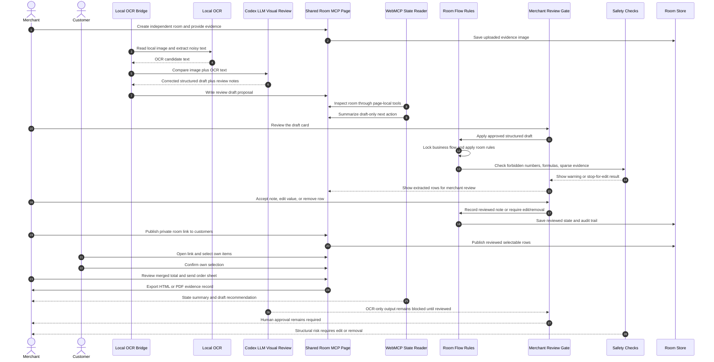
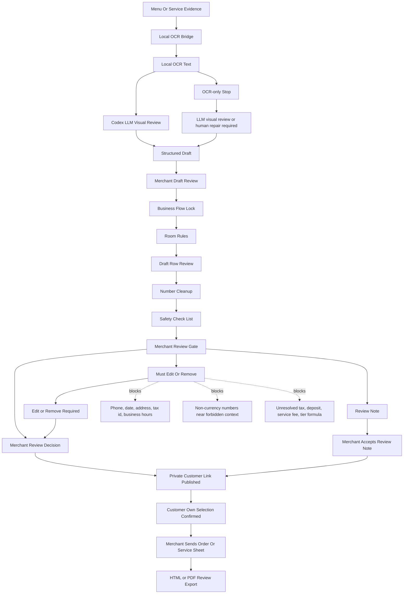

# Shared Room MCP

Powered by Adaptive Contract MCP.

Practical commercial MCP workflow: a merchant uploads an electronic menu, customers enter a private booth link and order on their own devices, AI prepares the room state, and the merchant downloads the reviewed order details.

Shared Room MCP is the reference application for Adaptive Contract MCP, an open-source trust boundary layer for menu and service intake on the agent-native web. It is not a chatroom, messaging app, payment gateway, or auto-booking agent. In the demo script, a merchant uploads an electronic menu, opens a private booth link, customers enter the booth on their own devices, choose items, and the merchant reviews the merged order details before downloading the summary. Payments and formal external orders stay outside this project.

Live demo: https://shared-room-mcp-next.zeabur.app/

The app is English-first for judging and demo review. A Chinese UI dictionary remains available for local use, but the default page language, initial HTML, README, and submission packet are English.

Core claim: AI prepares the evidence review. Humans approve the commitment. The assistant can read the current private room, spot missing details, and prepare structured drafts. The merchant controls publication to customers, and each customer confirms only their own selection state.

Privacy boundary: every booth room is independent. The shared link, uploaded menu evidence, draft list, customer selections, merged totals, review decisions, and export summary belong to that one room. WebMCP tools read the current room state only; they do not browse unrelated rooms, payment accounts, vendor sessions, or external ordering systems.

Language boundary: the visible UI, review messages, and export labels are locked to the selected page language. Menu item names, shop text, and customer-entered names keep their source language. WebMCP tool names, schemas, descriptions, and JSON keys stay in English so the browser/sidebar agent receives a stable tool contract.

In the browser sidebar, the assistant uses WebMCP tools from the page itself. Here WebMCP means a page-local state reader and draft generator, not a browser agent that clicks or submits final actions for the user. It inspects the private intake room state and places draft suggestions on the page for merchant review.

WebMCP is not the multi-user sync layer. The ordinary web runtime keeps customer selections and totals in sync. WebMCP exposes the current room as scoped resources and tools so an assistant can review that one room without crossing into other rooms or external systems.

The intended loop is WebMCP plus Codex as a private task-review layer. Codex can inspect the room, compare the price evidence against the current list, and create a field-fix draft when a price list is read incorrectly, for example when quantity, subtotal, size, or add-on notes are confused with item prices. That draft waits for merchant review before the customer-facing list changes.

The review layer keeps a short photo clue, source area, and review reason for each extracted field so the merchant can compare the draft against the source context. Pixel-level crop and bounding-box overlays are reserved in the schema as a roadmap extension; they are not required for the current deterministic integration benchmark.

Semantic Visual Anchor Notice: this system currently implements semantic visual anchoring with hierarchical logical zones (`boundingZone`) paired with contextual snippets (`auditAnchor`). Pixel-level spatial boxes (`bbox`) and crop overlays are reserved protocol fields for a future visual review overlay.

## Why This Fits WebMCP

Many real-world commitments now start from messy evidence: menu photos, drink boards, takeout lists, service forms, maintenance checklists, booking pages, campaign notes, receipts, copied text, or screenshots. These flows rarely have stable APIs or clean data. The merchant often has only a screenshot, a public post, or a partial form.

WebMCP is a good fit because the assistant can enter the same private intake room as the merchant, read only that room through page tools, find missing confirmations, and prepare the next review action from structured room state.

## How We Checked It

The demo is not only a single happy-path recording. Before submission, the room flow was checked in two layers:

- Current live smoke checks against the Zeabur URL after deployment.
- Repeatable local regression scripts with higher test-only rate limits.

Large repeat counts are local regression evidence, not claims of live production capacity.

The full check summary is in [`docs/testing/VALIDATION_EVIDENCE.md`](docs/testing/VALIDATION_EVIDENCE.md).

| check | current claim | verification method |
|---|---|---|
| Zeabur post-deploy health | Pending recheck after this commit deploys | live `/healthz` must show the mounted `/data/rooms.json` store, no active external/local image provider, `localVisionConfigured=false`, and `allowRemoteVisionFallback=false` |
| Zeabur room/customer/export smoke | Pending recheck after this commit deploys | `npm run stress:customer-publishing -- --base-url https://shared-room-mcp-next.zeabur.app --rounds 1 --fail-fast` against generated test rooms |
| Local OCR + Codex LLM proposal apply smoke | PASS on 2026-09-04 | `npm run demo:codex-ocr-llm -- --base-url http://127.0.0.1:3224 --accept-for-test`; OCR read 767 characters from the synthetic merchant menu image, `reviewProvider=codex_guided`, `codexNodeCompleted=true`, accepted draft applied 18 rows, and customer publishing stayed closed |
| Local contract regression | 40/40 current fast run; older 60/60 and 400/400 runs retained as regression evidence | `npm run stress:contracts` with test-only local rate limits; raw runtime logs stay ignored and are summarized in validation evidence |
| Local HITL Customer Publishing regression | 4/4 current fast run; older 8/8, 12/12, and 80/80 runs retained as regression evidence | `npm run stress:customer-publishing`; verifies draft gate, merchant publishing, customer confirmation, merchant finalization, language-locked HTML export, and PDF export |
| Deterministic image oracle integration | Previous 115/115 artifact-backed run | `npm run stress:image-matrix -- --mode image-plus-oracle-text` requires the external `IMAGE_MATRIX_ROOT` PNG artifact; checksum-backed contract test, not OCR/provider accuracy |
| Security and release boundary | PASS | local `release-boundary-safety-gate`, `ai-security-rules rules-check`, and `npm audit` checks reported no blocking findings |

These checks show that the assistant workflow is repeatable and no-key by default. They are not a claim of production-scale database capacity. The default JSON save layer is for a single demo service; production traffic should use Redis or PostgreSQL.

## Core Product Boundary

This is a single-direction intake room. The merchant provides evidence and publishes the reviewed list after approval; customers select or confirm only their own part; final commitment stays behind merchant/customer review gates.

`Shared Room MCP` is the demo application and repository slug. `Adaptive Contract MCP` is the underlying contract, routing, prompt, guardrail, and HITL state-machine layer. The architecture name is used where the project discusses reusable scenario contracts, image-fixture oracles, enterprise submission gates, and anti-pollution review controls.

`Adaptive Contract MCP` is not a blockchain smart contract and not an autonomous execution engine. It means adaptive room terms drafted from evidence, validated by strict schemas, reviewed through WebMCP/Codex, and executed only after human approval.

Core loop for this demo: local OCR produces candidate text; Codex occupies the LLM/visual-review node, checks the menu image, and prepares a structured draft; WebMCP scopes that draft to the current room; the human edits, confirms, and releases the final commitment.

中文口徑：圖片 -> 本地 OCR -> Codex 看圖校正 -> 結構化草稿 -> 人工審核 -> 通過。

Threshold conditions such as "minimum 12 people" are review notes. The assistant can flag the gap between the evidence and the current room, but it cannot promise that a group has formed, that a booking is valid, that payment is complete, or that the final summary is complete. The merchant can review, override, edit, and proceed; that human action is the commitment.

AI provider adapters are extension-only:

- Pasted text and local rule-based parsing seed draft evidence only; they are not a completed image review by themselves.
- For the hosted Zeabur demo, local OCR runs first, Codex handles visual review, and the authorized local bridge writes a draft-only WebMCP proposal back to the cloud room for merchant review.
- The core WebMCP workflow must work without any paid API key.
- Codex and the browser sidebar provide the intended LLM collaboration layer: visual review, evidence comparison, field-fix suggestions, and state guidance.
- WebMCP is the primary agent integration; external model APIs are not required for the agent workflow.
- Server-side Gemini/OpenAI/local-model adapters exist only as replaceable examples for deployment owners who explicitly choose a different image-reading or schema-repair implementation outside the core Codex demo path.
- Zeabur is not the OCR engine. In the hosted demo, Zeabur is the state storage, MCP protocol host, HITL approval gate, guardrail runtime, customer publishing surface, and export surface. It receives uploaded evidence details and merchant-reviewed draft proposals, then runs the room state machine, guardrails, customer publishing, and exports.

## System Boundary Standard

This project is an AI-assisted commercial intake room, not an autonomous agent. Evidence ingestion and text extraction can happen through copied text, browser-side helpers, local OCR, or optional deployment-owner adapters. Those sources only seed draft rows. WebMCP and Codex review the current room state and evidence, then prepare draft suggestions. Human clicks are required for parsed-item approval, customer publishing, customer confirmation, overrides, and final summary export.

Zeabur hosts the room state and approval workflow. Zero required ML/OCR workload is processed on the Zeabur server in the default WebMCP Challenge path.

## Open Source Tool-Layer Positioning

This repository is intended to be a clean, forkable WebMCP starter project. It does not sell API access, resell model credits, require store integration, or require a fixed OCR provider.

Deployment owners can keep the default no-key flow, remove the extension adapter code, or replace it with their own local OCR, browser-side OCR, vision, commerce, spreadsheet, or private-community integrations. The stable part is the shared room workflow and the WebMCP tools, not any paid API.

External developers should be able to fork the template and plug in their own integrations without asking for access to a central service. High-risk commitments stay behind explicit merchant/customer confirmation.

Reviewed rooms can export a local HTML or PDF review record as evidence of the private room decision state.

## Future Extension Modules

The menu and service intake room is the first reference use case, not the product boundary. The project is best for workflows where the assistant can prepare a draft and people still need to review it before an irreversible action.

Core extension examples:

- Activity signup draft: collect attendee names, ticket classes, dietary notes, and prepare a registration task proposal.
- Community purchase comparison: summarize options, threshold rules, and customer interest before anyone pays.
- Maintenance or warranty request draft: organize receipt text, product model, photos, and contact fields for human review.
- Private community task coordination: turn merchant-provided evidence into tasks, reviewers, and review steps.
- Shared booking draft: collect time slots, customer availability, room/court/package options, and prepare a booking task proposal.

Possible future integrations:

- Auto repair appointment draft: collect car model, symptoms, preferred time, shop notes, and create a booking task proposal for the merchant or service team to confirm.
- Nail, hair salon, clinic, or local service reservation draft: gather service type, preferred time, staff preference, notes, and prepare a reservation task proposal. Service details remain structured notes for the provider, not an in-room conversation channel.

The hackathon demo should focus on the single-direction room workflow: a merchant creates the intake room, the assistant prepares evidence review, customers act on their own rows only after publication, and final confirmation remains human-controlled.

Repository slug: `shared-room-mcp`.

## Commercial Extension Model

The open-source core is the WebMCP room template: room types, shared state, local math, review steps, and assistant-readable tools. Commercialization should happen through replaceable integrations, not hard-coded platform lock-in.

Potential integration categories:

- Booking integrations for auto repair shops, salons, clinics, local services, and venue reservations.
- Commerce integrations for product catalogs, group-buy thresholds, inventory checks, discount rules, and checkout handoff.
- Community integrations for LINE, Discord, Telegram, forums, and private membership spaces.
- Trust integrations for whitelist checks, short-lived invite validation, review logs, and organization policy checks.
- Provider integrations for OCR, vision, translation, summarization, and field repair, when the deployment owner explicitly adds them as extensions.

This keeps the template useful for developers and safer for users: the project can support future business workflows while keeping irreversible commitments in purpose-built partner systems and explicit human review gates.

## WebMCP Tools

The browser page registers tools with `document.modelContext.registerTool()` when WebMCP is available.

Implemented tools:

- `inspect_room`
- `get_task_router`
- `get_claim_audit`
- `get_formula_contract`
- `get_trust_layer_contract`
- `suggest_next_actions`
- `create_action_proposal`

The `suggest_next_actions` tool is the main way for the assistant to read the room and suggest what should happen next. It points out missing reviews, missing confirmations, and evidence/field mismatches from structured room state.

The `create_action_proposal` tool creates a merchant-reviewed draft. Supported drafts include claim review, missing confirmation, evidence review, business-flow review, activity signup drafts, and field-fix drafts when Codex notices a reading mistake. The page keeps only one pending draft per draft type, so the merchant sees one clear card for one decision. The merchant presses the same card button to arm and confirm the review before the room state changes.

## Safety Flow

The UI uses plain language, and the code keeps the same order every time: AI prepares a draft, the merchant reviews the list, the merchant publishes it to customers, customers confirm their own selections, and only then can the merchant finalize the room summary. Later steps may stop and ask for review, while accepted human decisions remain explicit state transitions.

| step | what happens | what is blocked |
|---|---|---|
| Assistant prepares | AI stores a draft for merchant review | Draft remains pending until merchant review |
| Merchant reviews | Merchant fixes or removes parsed rows before customer access | Customer list is published only after review |
| Merchant publishes | Merchant explicitly publishes the reviewed list to customers | Parsed item editing is locked after publishing |
| Customers confirm | Each customer confirms only their own selections | Confirmation is scoped to the current customer |
| Merchant finalizes | Merchant finalizes after human confirmations | Export reads the reviewed room summary |
| Optional integrations | Deployment owner may add OCR, Sheets, booking, or trust helpers | Core demo works with local-first parsing |

The project has six fixed safety checks. Each check passes a limited result forward. Later checks may mark something for review, but they cannot silently rewrite earlier choices.

| safety check | job | output boundary |
|---|---|---|
| Choose the room type | Selects or infers the scenario | Room type changes require review state |
| Read the price evidence | Extracts item and price candidates from image-backed local OCR plus LLM visual review | Parser output starts as candidate evidence |
| Calculate locally | Calculates totals inside the app | Calculation remains in the room contract |
| Repair unclear fields | Creates a review draft only when the input is unclear | Repairs move through merchant proposal state |
| Check confirmations | Tracks shared items and customer add-ons | Confirmations are customer-scoped |
| Keep AI in draft mode | Exposes read tools plus draft creation | Agent output is proposal or state guidance |

## Supported Room Types

The table below describes the room types and what the app can safely calculate today. It is not a claim that every advanced business rule is fully automated. Rules such as hourly rates, deposits, shipping allocation, and tier discounts stay behind manual review until a deployment owner finishes and tests those inputs.

| room type | scenario | evidence | calculated today | needs review when |
|---|---|---|---|---|
| `group_buy` | Community group buy, free-shipping threshold, bulk discount | Public post image, price table image, screenshot | Same-item merge, customer subtotal, grand total, threshold remaining, customer add-on | Missing item-price pairs, ambiguous tier rules, duplicated variants |
| `drink_order` | Office or community drink order | Menu photo, drink screenshot | Item subtotal, sweetness/ice/addon delta, customer add-on, minimum order threshold | Size-column drift, addon section ambiguity, same-name multi-price issue |
| `restaurant_split` | Meal bill or receipt split | Menu, receipt, checkout screenshot | Customer items, shared candidate average, customer add-on, service-fee input marked for manual review | Tax/service lines mixed with items, item-price mismatch |
| `ktv_room` | KTV room, minimum spend, headcount fee | Room price table, minimum-spend notice, drink list | Room fee sharing, per-person minimum marked for manual review, personal drinks | Time-slot or package boundary ambiguity |
| `sports_venue` | Court fee, venue booking, equipment rental | Venue rate table, time-slot table, rental list | Venue fee sharing, time-rate input marked for manual review, equipment subtotal | Cross-column time rates, venue and equipment mixed in one image |
| `ticket_activity` | Tickets, workshops, activity signup | Activity post, ticket table, signup screenshot | Headcount times ticket price, group threshold and group discount marked for manual review | Early-bird tiers or ticket classes are unclear |
| `rental_share` | Shared rental, deposit, equipment | Rental table, deposit notice | Rental fee sharing, personal rental subtotal, deposit marked but excluded by default | Deposit and fee ambiguity, unclear time unit |
| `generic_split` | Any temporary shared expense | Receipt, price screenshot, merchant evidence notes | Grand total, average split, customer items | Low classification confidence or missing fields |

## Adaptive Contract MCP Overview

## Permission And Review Order

| role | can inspect | can draft suggestions | can edit parsed items | can edit own selections | can approve drafts | can finalize |
|---|---:|---:|---:|---:|---:|---:|
| Anonymous viewer | yes | no | no | no | no | no |
| Local OCR | local image only | no | no | no | no | no |
| Codex LLM visual review | authorized evidence and OCR text | structured draft only | no | no | no | no |
| Authorized local bridge | target room and reviewed draft | proposal only | no | no | no | no |
| WebMCP agent | yes | proposal only | no | no | no | no |
| Customer | yes | no | no | own selections only | no | no |
| Merchant | yes | yes | before customer confirmation | own selections only | same-card human review | yes |
| Server | validates | stores limited drafts | checks merchant authority | checks each customer only confirms themself | records review result | saves local room summary |

The fixed order is evidence draft first, OCR plus LLM visual review second, merchant review third, customer publishing fourth, customer confirmation fifth, and merchant finalization last. The merchant can remove bad photo-reading rows or fix names, prices, and categories before publishing the list to customers. After the merchant publishes the list, parsed item editing is locked.





The detailed architecture diagram and contract boundaries are in [`docs/architecture/ADAPTIVE_CONTRACT_MCP.md`](docs/architecture/ADAPTIVE_CONTRACT_MCP.md).

## Environment Variables

Required runtime variables:

```bash
HOST=0.0.0.0
PORT=3000
CORS_ORIGIN=
ROOM_TTL_HOURS=12
ROOM_PERSISTENCE=json
ROOM_STORE_PATH=data/rooms.json
GUARDRAIL_MEMORY_PATH=data/guardrail-memory.json
ROOM_PERSIST_DEBOUNCE_MS=35
ROOM_PERSIST_JITTER_MS=120
MAX_IMAGE_MB=8
RATE_LIMIT_WINDOW_MS=60000
API_RATE_LIMIT_MAX=180
ROOM_CREATE_RATE_LIMIT_MAX=20
MENU_PARSE_RATE_LIMIT_MAX=30
LOCAL_OCR_FIRST=true
LOCAL_OCR_MIN_ITEMS=3
LOCAL_OCR_MAX_CHARS=12000
TRUST_LAYER_SPREADSHEET_ID=replace_with_google_sheet_id_for_whitelist_audit_only
```

Extension-only adapter variables:

```bash
AI_PROVIDER_ORDER=local_vision,gemini,openai
LOCAL_VISION_BASE_URL=
LOCAL_VISION_MODEL=
LOCAL_VISION_API_KEY=
LOCAL_VISION_API_STYLE=chat
LOCAL_VISION_TIMEOUT_MS=60000
LOCAL_VISION_MAX_OUTPUT_TOKENS=16000
LOCAL_VISION_IMAGE_DETAIL=high
ALLOW_REMOTE_VISION_FALLBACK=false
GEMINI_API_KEY=
GOOGLE_API_KEY=
GOOGLE_GENERATIVE_AI_API_KEY=
GOOGLE_GEMINI_API_KEY=
GEMINI_KEY=
GEMINI_MODEL=gemini-2.5-flash
GEMINI_MODEL_FALLBACKS=gemini-2.5-flash-lite,gemini-flash-latest
GEMINI_RETRY_ATTEMPTS=2
GEMINI_TIMEOUT_MS=25000
OPENAI_API_KEY=
OPENAI_MODEL=gpt-5.4-mini
OPENAI_MODEL_FALLBACKS=
OPENAI_TIMEOUT_MS=35000
OPENAI_MAX_OUTPUT_TOKENS=16000
OPENAI_IMAGE_DETAIL=high
```

Do not commit API keys. These variables are not required for the WebMCP Challenge demo. Set them only when a deployment owner intentionally enables an external adapter outside the core WebMCP plus Codex-guided review plus human-review path.

Runtime requires Node.js `>=20.9.0` because the image normalization pipeline uses `sharp@0.35.x`.

## Deployment Configuration Guide

The repository provides configuration names only. Each project organizer changes values in the deployment platform, not in source code. Paid provider keys are extension adapters, not part of the required WebMCP demo path.

| purpose | variable | where to replace | required |
|---|---|---|---|
| Server port | `PORT` | hosting service variables | yes |
| Same-origin or allowlisted Socket.IO origin | `CORS_ORIGIN` | leave empty for a same-origin deployment; set only for a separate frontend domain | optional |
| Room JSON store | `ROOM_STORE_PATH` | hosting service variables, use `/data/rooms.json` with a mounted volume | yes for restart-safe demo |
| Guardrail memory candidate store | `GUARDRAIL_MEMORY_PATH` | hosting service variables, use `/data/guardrail-memory.json` with a mounted volume | optional |
| Room save smoothing | `ROOM_PERSIST_DEBOUNCE_MS`, `ROOM_PERSIST_JITTER_MS` | hosting service variables; small millisecond values smooth short write bursts | optional |
| Trust whitelist/audit sheet | `TRUST_LAYER_SPREADSHEET_ID` | hosting service variables | optional |
| External Gemini repair adapter | `GEMINI_API_KEY` or supported Google key alias | provider secret manager | extension-only |
| External OpenAI repair adapter | `OPENAI_API_KEY` | provider secret manager | extension-only |
| Public rate limit | `API_RATE_LIMIT_MAX`, `ROOM_CREATE_RATE_LIMIT_MAX`, `MENU_PARSE_RATE_LIMIT_MAX` | hosting service variables | yes |

Recommended open-source deployment order:

1. Copy `env.sample` variable names into the hosting service variables.
2. Mount a persistent volume at `/data` and set `ROOM_STORE_PATH=/data/rooms.json`.
3. For the adaptive review loop, set `GUARDRAIL_MEMORY_PATH=/data/guardrail-memory.json` so human corrections and blocked approval attempts are retained as guardrail candidates.
4. Run the no-key flow first with the authorized local bridge: image -> local OCR -> LLM visual review -> structured draft -> merchant review.
5. Leave provider keys empty for the WebMCP Challenge demo unless the deployment owner intentionally enables an external repair adapter.
6. Restart the service and verify `/healthz` reports persistence flags and does not expose secret values.

## Enterprise MCP Submit Gate

Future company or third-party MCP templates should enter through a default-deny submit gate before the runtime can load them:

```text
submitted template -> package boundary -> static security gate -> semantic safety gate -> contract schema -> industry routing -> repeat regression -> human approval -> accepted registry
```

The security gate is split into two mandatory phases. The static gate rejects secrets, over-privileged MCP configs, install hooks, package-runner risks, unsafe public-export payloads, and unbounded filesystem or network scope. The semantic safety gate then reviews prompts, tool descriptions, and agent-readable files for prompt injection, hidden intent, jailbreak patterns, or policy-bypass language before any submitted MCP file is trusted by the parser or runtime.

Enterprise submissions must also declare provenance, permissions, data/privacy class, SBOM/dependency evidence, sandbox policy, human final-action boundaries, revocation path, and audit/SLA metadata. Approved artifacts are promoted into an accepted registry tier; experimental artifacts stay sandboxed.

Local validation entrypoints:

```bash
npm run verify:adaptive-contracts
npm run regression:adaptive-parser -- --base-url http://127.0.0.1:4180 --repeat 5
IMAGE_MATRIX_ROOT=/path/to/downloaded/image-matrix npm run build:image-fixture-manifest
```

The matching design contract is in `config/enterprise-submit-gate.json`. The image fixture manifest is a checksum-backed oracle for external image artifacts; the large PNG set can stay outside the main repository while the repo keeps the repeatable runner and expected contract.

## Fast Review Sample

For judging or a quick local smoke test, open a new empty room and click `Load Sample Room`. This creates a small structured sample with shared items and customer add-ons, then adds a draft-only proposal for the merchant to review.

The sample path is intentionally no-key and no-upload:

- It does not call Gemini, OpenAI, Google Sheets, payment, booking, commerce, or social APIs.
- It does not overwrite a room that already has data.
- It creates a draft that waits for merchant review.
- The merchant must still confirm the same draft card before the draft status changes.
- Accepting the draft does not settle the bill, submit an external form, write payment data, or change formula rules.

## Local Development

```bash
npm install
npm run check
npm run audit:tasks
npm start
```

Open `http://localhost:3000`.

The app does not automatically load `.env`. The default demo uses the authorized local bridge, `Load Sample Room`, WebMCP inspection tools, Codex review, and human approval. API keys are only for optional external repair adapters.

## Hosted Deployment

1. Connect the public GitHub repository to a Node.js hosting service. The live demo currently runs on Zeabur.
2. Create a Node.js service.
3. Set the required environment variables listed above.
4. Keep AI provider keys empty for the clean WebMCP tool-layer demo.
5. Add a persistent volume and set `ROOM_STORE_PATH=/data/rooms.json` if rooms must survive service restarts.
6. Keep the public demo on one service instance when using JSON persistence.
7. Use `npm install` as the install command and `npm start` as the start command.

Recommended public-demo limits:

```bash
RATE_LIMIT_WINDOW_MS=60000
API_RATE_LIMIT_MAX=180
ROOM_CREATE_RATE_LIMIT_MAX=20
MENU_PARSE_RATE_LIMIT_MAX=30
```

The expensive endpoint is evidence parsing, not WebMCP inspection. The public demo allows 30 parse requests per client per minute while retaining basic abuse protection.

## Verification

```bash
npm run check
npm run audit:tasks
npm run stress:contracts -- --base-url http://127.0.0.1:3000 --rounds 20 --concurrency 4 --output-dir logs/runtime
IMAGE_MATRIX_ROOT=/path/to/downloaded/image-matrix npm run build:image-fixture-manifest
IMAGE_MATRIX_ROOT=/path/to/downloaded/image-matrix npm run stress:image-matrix -- --base-url http://127.0.0.1:3000 --mode image-plus-oracle-text --output-dir logs/runtime/image-matrix
IMAGE_MATRIX_ROOT=/path/to/downloaded/image-matrix npm run stress:image-matrix -- --base-url https://shared-room-mcp-next.zeabur.app --mode image-plus-local-ocr --tesseract-bin /opt/homebrew/bin/tesseract --delay-ms 5000 --limit 3 --continue-on-failure --output-dir logs/runtime/image-matrix-local-ocr-canary
```

For repeated local stress runs, start the local server with test-only rate limits so the test measures state-machine behavior instead of the public-demo throttle:

```bash
ROOM_CREATE_RATE_LIMIT_MAX=500 MENU_PARSE_RATE_LIMIT_MAX=500 API_RATE_LIMIT_MAX=1000 npm start
```

The hosted public demo should keep the lower public-demo limits shown above.

The repeated room-flow check covers 20 non-duplicate Traditional Chinese and English scenarios, with 20 rounds per scenario. It checks room creation, candidate evidence parsing, stable room-type selection, draft creation, and the final human approval rule.

The image-matrix runner is a deterministic contract-driven integration benchmark using 115 paired image-oracle artifacts. The public repository keeps the manifest, schema, and runner; the full PNG set is supplied as an external artifact through `IMAGE_MATRIX_ROOT` or `--matrix-root`. Each test verifies the image SHA-256, scenario id, language, contract id, archetype, expected customer-visible items, rule counts, forbidden customer-visible numbers, evidence pointers, and Semantic Visual Anchor fields.

The runner has three modes with different claims:

- `image-only`: uploads only the image. This is a negative canary unless the deployment owner has configured an explicit image-reading provider. It must not be used to claim the default Zeabur demo performs OCR.
- `image-plus-local-ocr`: runs OCR through the authorized local bridge first, then writes OCR details and a draft proposal into the hosted room. Zeabur still acts as the room/runtime/HITL surface, not as the OCR engine. This mode is a canary for field isolation, evidence pointers, forbidden-number leakage, and advisory threshold handling; completed image review still requires Codex visual review or merchant repair before customer publishing.
- `image-plus-oracle-text`: uploads the image plus the locked oracle text. This validates contract routing, guardrails, customer-visible masks, and HITL state transitions. It is not proof of visual OCR accuracy.

These checks must not be described as provider accuracy, zero-shot extraction accuracy, unconstrained vision accuracy, or a hosted image-recognition benchmark. The intended evidence-review loop is WebMCP plus local OCR plus Codex LLM visual review plus human approval.

Expected audit state:

- room type selection ready
- evidence and copied-text review ready
- local calculation rules ready
- customer confirmation checks ready
- WebMCP tools ready
- Google Sheets trust option design documented
- submission local package ready

## Demo Script

The locked recording flow is:

1. Start on the live Merchant Menu Intake page with the agent side panel visible.
2. Run `npm run demo:codex-ocr-llm -- --base-url https://shared-room-mcp-next.zeabur.app` from the local repo. If no image is supplied, the script generates a fictional English menu image under the local temp folder, runs Tesseract OCR, lets Codex occupy the LLM/visual-review node, and sends a Codex-reviewed structured draft into a new Zeabur room.
3. The authorized local review bridge treats OCR as noisy text, records the Codex-guided visual review result, writes one review draft proposal, and leaves the draft pending for the merchant.
4. The presenter moves the pointer to the single draft card and the agent tells the merchant when to click. The merchant clicks the same card twice: first to mark it reviewed, then to confirm the green approval state.
5. The agent opens the same room in a second tab as `Jamie`, selects one item, and pauses. Jamie clicks the selection confirmation button once.
6. The agent immediately returns to the merchant tab, verifies the customer state, and pauses. The merchant clicks `Merchant Finalizes Summary` once.
7. The merchant clicks `Download PDF`, then `Download HTML`. Both files must open successfully before the recording continues.
8. Open a new room, switch to Chinese, and upload the prepared `社區水果免運團購` image. The threshold and shipping lines must remain review context rather than purchasable items.
9. Repeat the same controlled loop quickly: agent prepares, the human approves on one card, a second customer confirms their own item, and the merchant finalizes.
10. Close by stating that payment, booking submission, and external account actions remain outside the exposed tool set.

Use this spoken line near the start:

"AI prepares a local review draft and writes it into the room. Humans approve the commitment."

Use this closing line:

"WebMCP lets the agent prepare and check merchant review drafts while people keep every commitment. The same pattern can support shared orders, registrations, bookings, and other customer-facing intake workflows without exposing final payment or external submission as an agent tool."

The detailed timed runbook is in [`docs/submission/WEBMCP_SUBMISSION.md`](docs/submission/WEBMCP_SUBMISSION.md#locked-demo-runbook).

## Compliance Notes

- No fake account scraping.
- No vendor API reverse engineering.
- No authenticated vendor cookies.
- No payment processing.
- No raw device fingerprinting.
- No raw extracted text, images, raw device IDs, payment identifiers, or social account identifiers are written to Google Sheets.
- Google Sheets is only a design-level short-lived hash whitelist and audit-log trust layer in this public core; production check/enroll/revoke adapters are roadmapped extensions.

## Known MVP Limits

- Room data is saved to a local JSON file by default. On a hosted service, attach a volume and set `ROOM_STORE_PATH=/data/rooms.json`; otherwise a platform restart can still clear room state.
- The current save layer is meant for one demo service instance. It smooths short write bursts by merging nearby changes and adding a small millisecond delay before saving, but a hard crash can still lose the latest tiny write window. Production traffic should move to Redis or PostgreSQL.
- Room authority is demo-grade. Production deployments should add signed sessions or a real login system.
- Image-reading quality depends on image clarity and on the OCR or vision tool selected by the deployment owner. If a local/browser/provider extraction step times out or produces sparse evidence, the app should fall back to manual review instead of inventing missing fields.
- Advanced rules such as shipping split, hourly venue fee, room minimum, deposit include/exclude, tax/service formulas, and tier discounts route to merchant review. The current MVP does not claim fully automated complex formula calculation.
- Google Sheets trust-layer check/enroll/revoke adapters are design-level roadmap extensions, not production-ready identity infrastructure in this public core.
- Pixel-level visual crop overlays are reserved in the schema roadmap. The current UI uses semantic anchors and contextual snippets.
