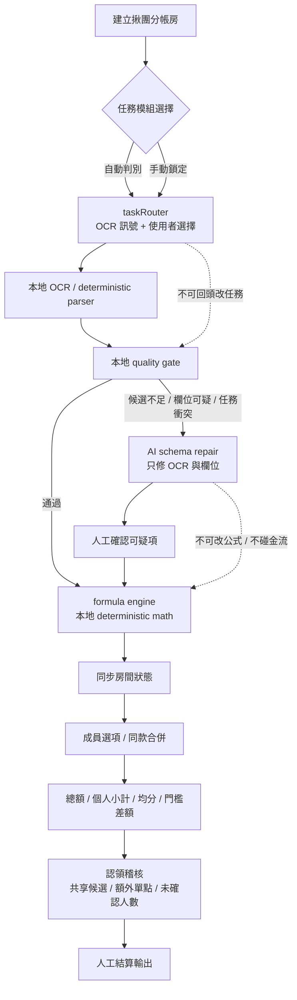
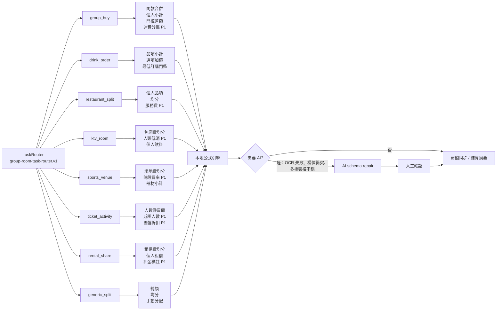
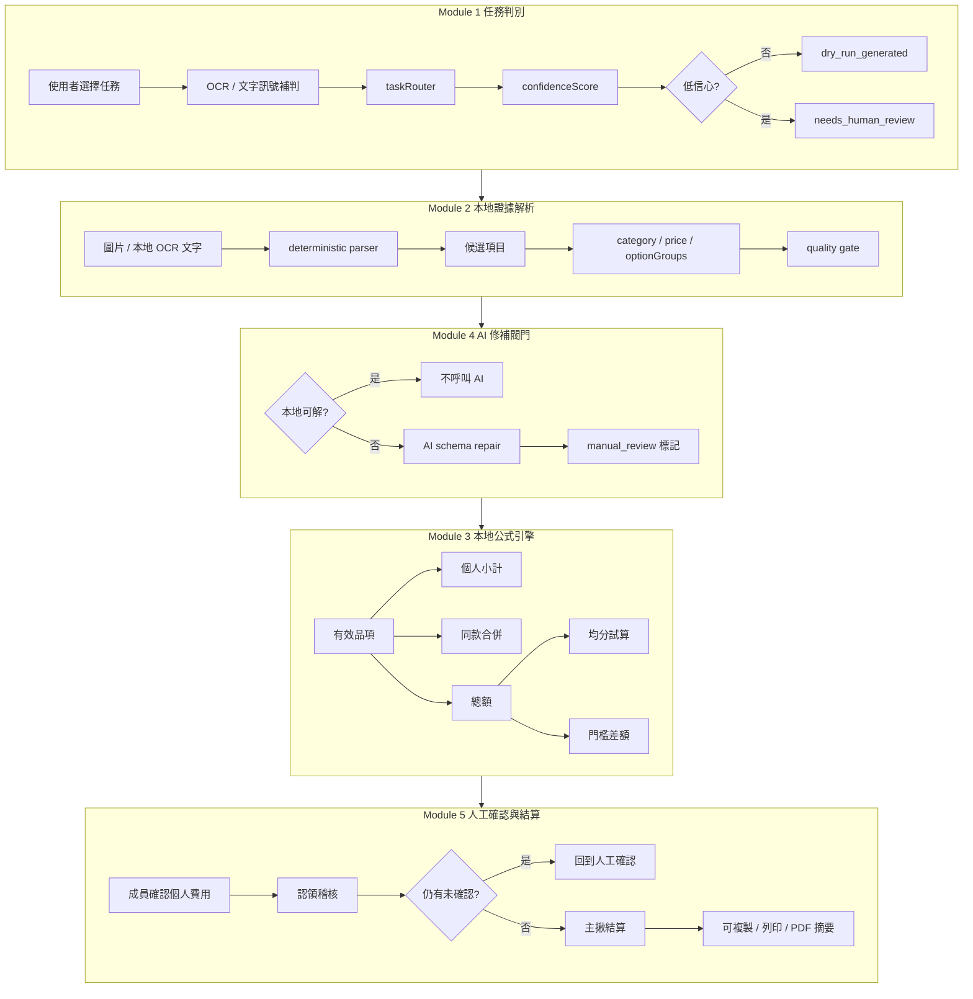
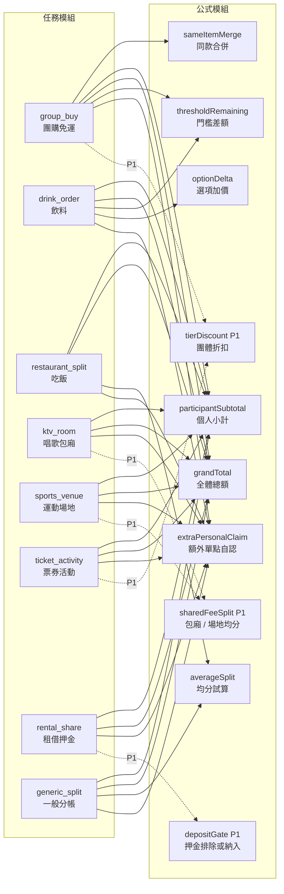
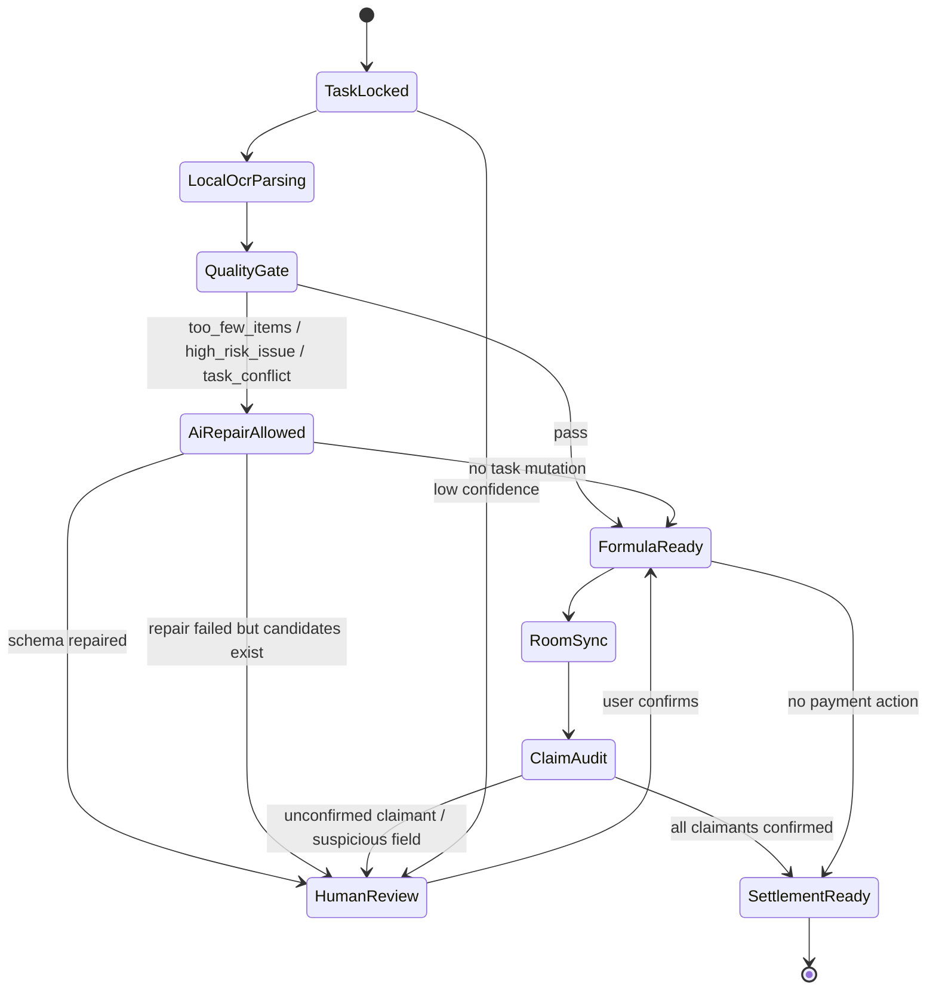
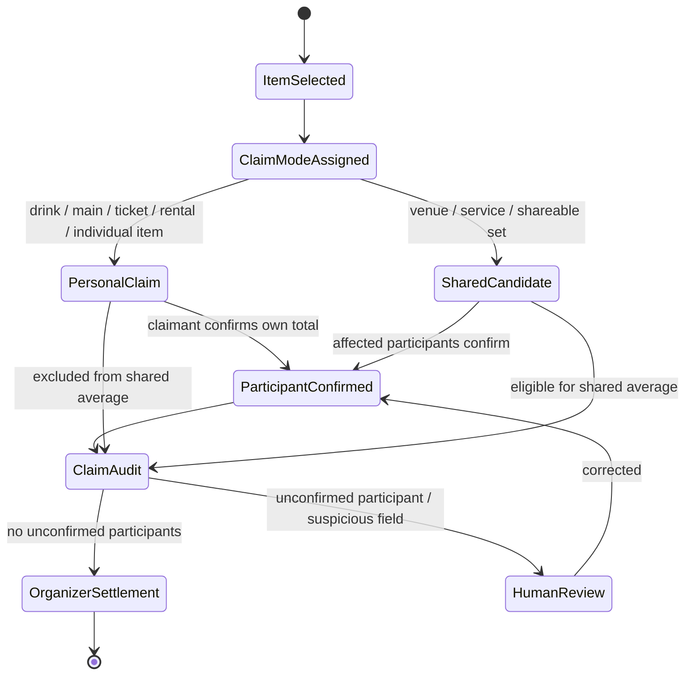

# Group Room Mermaid Module Design

日期：2026-08-31
範圍：揪團分帳房 WebMCP demo 架構圖

## 完整模組總覽

```mermaid
flowchart TD
  A[建立揪團分帳房] --> B{任務模組選擇}
  B -->|自動判別| C[taskRouter<br/>OCR 訊號 + 使用者選擇]
  B -->|手動鎖定| C
  C --> D[本地 OCR / deterministic parser]
  D --> E[本地 quality gate]
  E -->|通過| F[formula engine<br/>本地 deterministic math]
  E -->|候選不足 / 欄位可疑 / 任務衝突| G[AI schema repair<br/>只修 OCR 與欄位]
  G --> H[人工確認可疑項]
  H --> F
  F --> I[同步房間狀態]
  I --> J[成員選項 / 同款合併]
  J --> K[總額 / 個人小計 / 均分 / 門檻差額]
  K --> L[認領稽核<br/>共享候選 / 額外單點 / 未確認人數]
  L --> M[人工結算輸出]

  C -.不可回頭改任務.-> E
  G -.不可改公式 / 不碰金流.-> F
```

## 任務模組與公式總覽

```mermaid
flowchart LR
  R[taskRouter<br/>group-room-task-router.v1] --> GB[group_buy]
  R --> DO[drink_order]
  R --> RS[restaurant_split]
  R --> KTV[ktv_room]
  R --> SP[sports_venue]
  R --> TA[ticket_activity]
  R --> RT[rental_share]
  R --> GS[generic_split]

  GB --> GBF[同款合併<br/>個人小計<br/>門檻差額<br/>運費分攤 P1]
  DO --> DOF[品項小計<br/>選項加價<br/>最低訂購門檻]
  RS --> RSF[個人品項<br/>均分<br/>服務費 P1]
  KTV --> KTVF[包廂費均分<br/>人頭低消 P1<br/>個人飲料]
  SP --> SPF[場地費均分<br/>時段費率 P1<br/>器材小計]
  TA --> TAF[人數乘票價<br/>成團人數 P1<br/>團體折扣 P1]
  RT --> RTF[租借費均分<br/>個人租借<br/>押金標註 P1]
  GS --> GSF[總額<br/>均分<br/>手動分配]

  GBF --> M[本地公式引擎]
  DOF --> M
  RSF --> M
  KTVF --> M
  SPF --> M
  TAF --> M
  RTF --> M
  GSF --> M

  M --> Q{需要 AI?}
  Q -->|否| OUT[房間同步 / 結算摘要]
  Q -->|是：OCR 失敗、欄位衝突、多欄表格不穩| AI[AI schema repair]
  AI --> HR[人工確認]
  HR --> OUT
```

## 小模組細項

```mermaid
flowchart TD
  subgraph M1[Module 1 任務判別]
    A1[使用者選擇任務] --> A2[OCR / 文字訊號補判]
    A2 --> A3[taskRouter]
    A3 --> A4[confidenceScore]
    A4 --> A5{低信心?}
    A5 -->|否| A6[dry_run_generated]
    A5 -->|是| A7[needs_human_review]
  end

  subgraph M2[Module 2 本地證據解析]
    B1[圖片 / 本地 OCR 文字] --> B2[deterministic parser]
    B2 --> B3[候選項目]
    B3 --> B4[category / price / optionGroups]
    B4 --> B5[quality gate]
  end

  subgraph M3[Module 3 本地公式引擎]
    C1[有效品項] --> C2[個人小計]
    C1 --> C3[同款合併]
    C1 --> C4[總額]
    C4 --> C5[均分試算]
    C4 --> C6[門檻差額]
  end

  subgraph M4[Module 4 AI 修補閥門]
    D1{本地可解?}
    D1 -->|是| D2[不呼叫 AI]
    D1 -->|否| D3[AI schema repair]
    D3 --> D4[manual_review 標記]
  end

  subgraph M5[Module 5 人工確認與結算]
    E1[成員確認個人費用] --> E2[認領稽核]
    E2 --> E3{仍有未確認?}
    E3 -->|是| E4[回到人工確認]
    E3 -->|否| E5[主揪結算]
    E5 --> E6[可複製 / 列印 / PDF 摘要]
  end

  M1 --> M2
  M2 --> M4
  M4 --> M3
  M3 --> M5
```

## 任務到公式細項

```mermaid
flowchart LR
  subgraph TaskModules[任務模組]
    T1[group_buy<br/>團購免運]
    T2[drink_order<br/>飲料]
    T3[restaurant_split<br/>吃飯]
    T4[ktv_room<br/>唱歌包廂]
    T5[sports_venue<br/>運動場地]
    T6[ticket_activity<br/>票券活動]
    T7[rental_share<br/>租借押金]
    T8[generic_split<br/>一般分帳]
  end

  subgraph FormulaModules[公式模組]
    F1[sameItemMerge<br/>同款合併]
    F2[participantSubtotal<br/>個人小計]
    F3[grandTotal<br/>全體總額]
    F4[averageSplit<br/>均分試算]
    F5[thresholdRemaining<br/>門檻差額]
    F6[optionDelta<br/>選項加價]
    F7[sharedFeeSplit P1<br/>包廂 / 場地均分]
    F8[depositGate P1<br/>押金排除或納入]
    F9[tierDiscount P1<br/>團體折扣]
    F10[extraPersonalClaim<br/>額外單點自認]
  end

  T1 --> F1
  T1 --> F2
  T1 --> F3
  T1 --> F5
  T1 --> F10
  T1 -.P1.-> F9
  T2 --> F2
  T2 --> F3
  T2 --> F5
  T2 --> F6
  T2 --> F10
  T3 --> F2
  T3 --> F3
  T3 --> F4
  T3 --> F10
  T4 --> F2
  T4 --> F3
  T4 --> F10
  T4 -.P1.-> F7
  T5 --> F2
  T5 --> F3
  T5 --> F10
  T5 -.P1.-> F7
  T6 --> F2
  T6 --> F3
  T6 --> F10
  T6 -.P1.-> F9
  T7 --> F2
  T7 --> F3
  T7 --> F10
  T7 -.P1.-> F8
  T8 --> F2
  T8 --> F3
  T8 --> F4
  T8 --> F10
```

## 狀態機

```mermaid
stateDiagram-v2
  [*] --> TaskLocked
  TaskLocked --> LocalOcrParsing
  LocalOcrParsing --> QualityGate
  QualityGate --> FormulaReady: pass
  QualityGate --> AiRepairAllowed: too_few_items / high_risk_issue / task_conflict
  AiRepairAllowed --> HumanReview: schema repaired
  AiRepairAllowed --> HumanReview: repair failed but candidates exist
  HumanReview --> FormulaReady: user confirms
  FormulaReady --> RoomSync
  RoomSync --> ClaimAudit
  ClaimAudit --> SettlementReady: all claimants confirmed
  ClaimAudit --> HumanReview: unconfirmed claimant / suspicious field
  SettlementReady --> [*]

  TaskLocked --> HumanReview: low confidence
  AiRepairAllowed --> FormulaReady: no task mutation
  FormulaReady --> SettlementReady: no payment action
```

## 認領稽核狀態

```mermaid
stateDiagram-v2
  [*] --> ItemSelected
  ItemSelected --> ClaimModeAssigned
  ClaimModeAssigned --> PersonalClaim: drink / main / ticket / rental / individual item
  ClaimModeAssigned --> SharedCandidate: venue / service / shareable set
  PersonalClaim --> ParticipantConfirmed: claimant confirms own total
  SharedCandidate --> ParticipantConfirmed: affected participants confirm
  ParticipantConfirmed --> ClaimAudit
  ClaimAudit --> OrganizerSettlement: no unconfirmed participants
  ClaimAudit --> HumanReview: unconfirmed participant / suspicious field
  HumanReview --> ParticipantConfirmed: corrected
  OrganizerSettlement --> [*]

  PersonalClaim --> ClaimAudit: excluded from shared average
  SharedCandidate --> ClaimAudit: eligible for shared average
```
