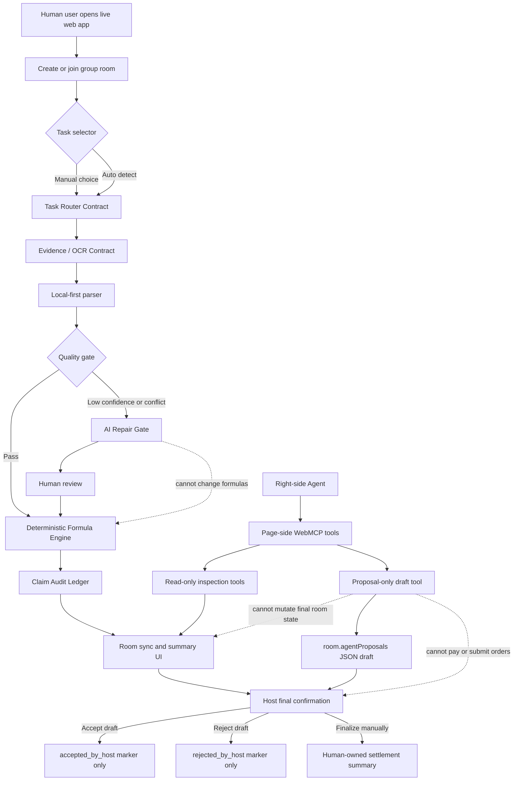
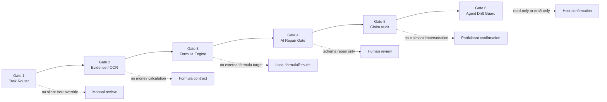
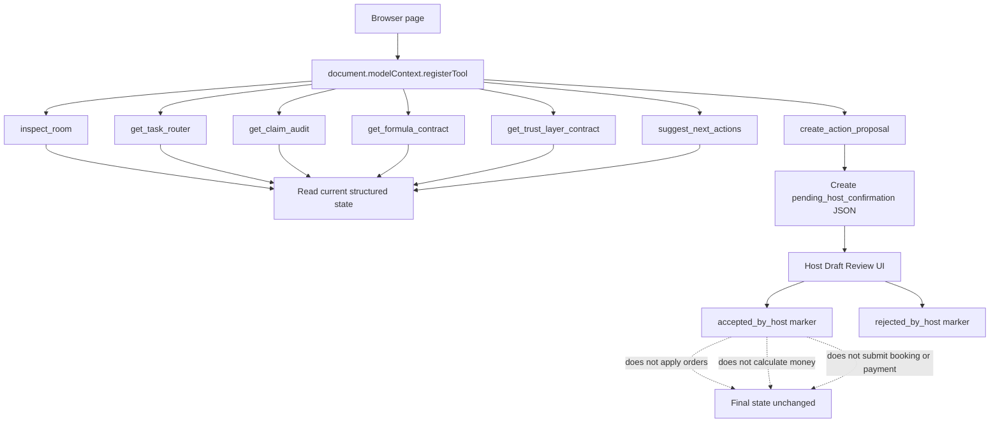
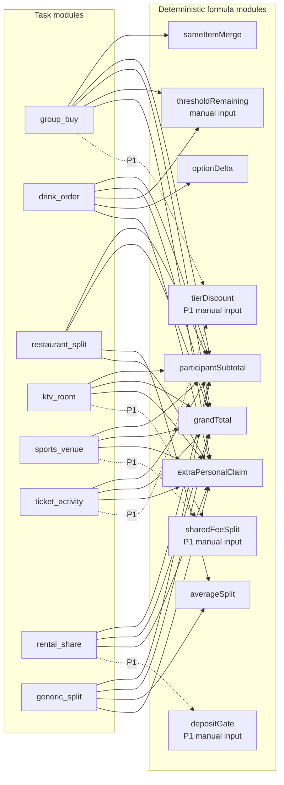
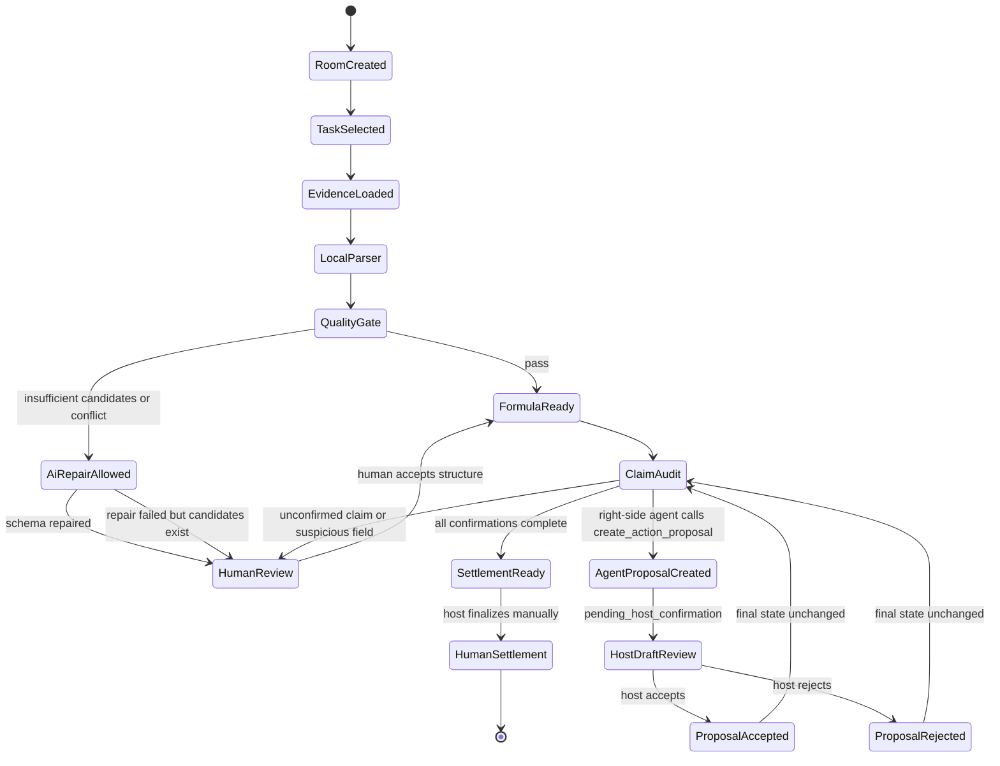
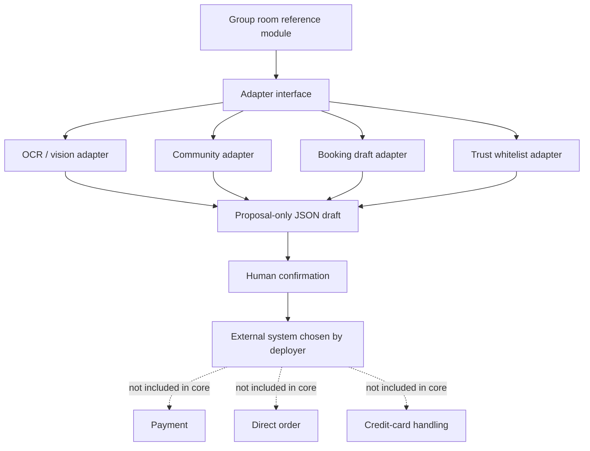

# Group Room Mermaid Module Design

Generated at: 2026-09-01

Scope: open-source WebMCP tool-layer template for pre-payment social coordination.

WebMCP tool surface version: `group-room-webmcp-tools.v2`.

## Full Module Overview

## Six Atomic One-Way Gates

## WebMCP Tool Surface

## Task And Formula Matrix

## State Machine

## Open-Source Extension Boundary

