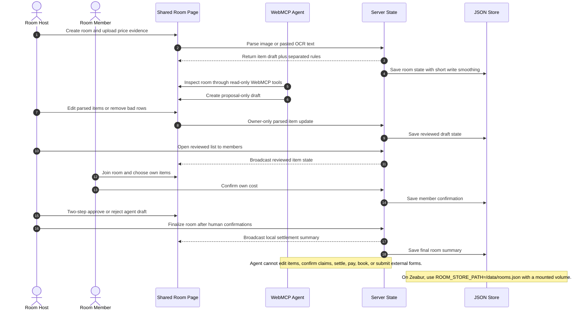
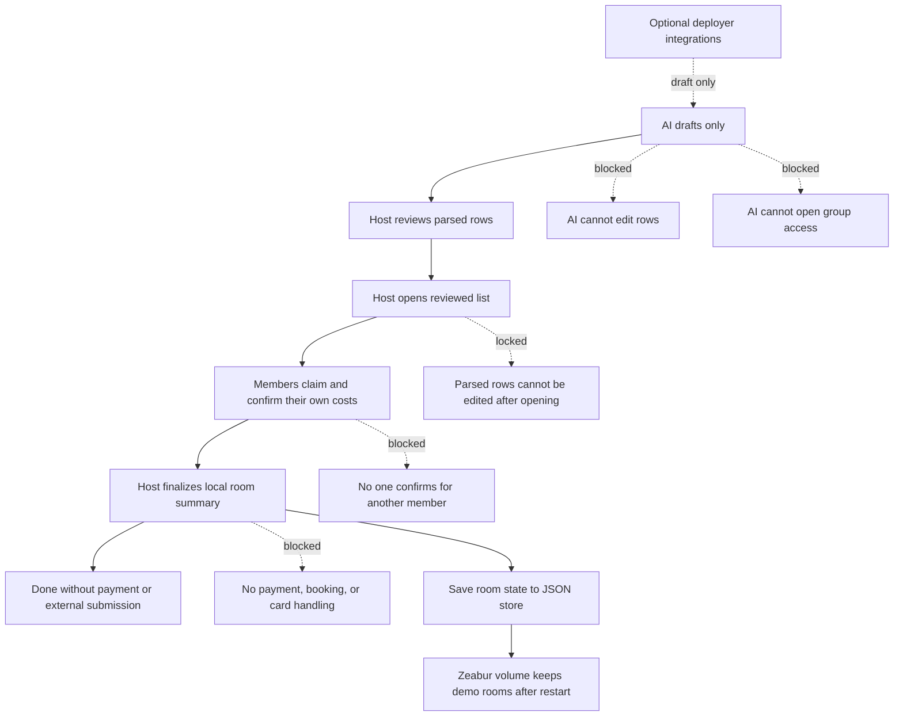
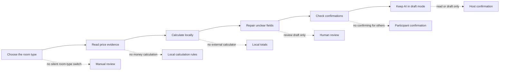
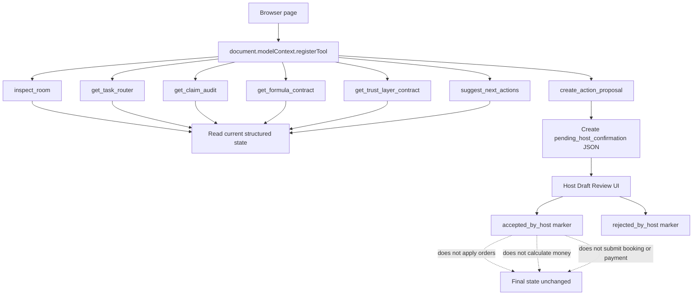
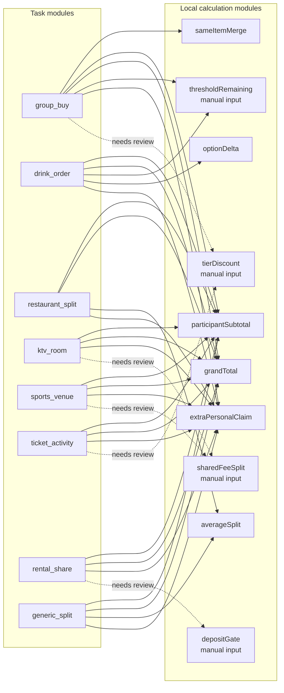
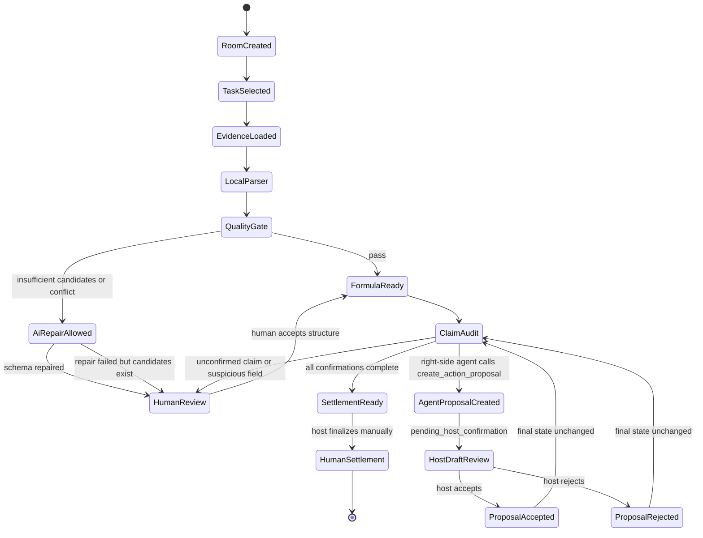
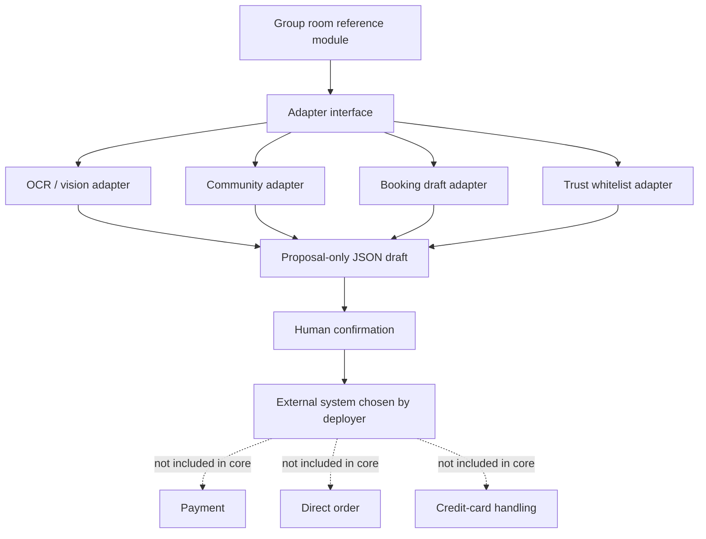

# Shared Room Mermaid Module Design

Generated at: 2026-09-01

Scope: open-source WebMCP tool-layer template for pre-payment social coordination.

WebMCP tool surface version: `group-room-webmcp-tools.v2`.

## Full Room Flow

## Permission Matrix

| role | inspect room | create proposal | edit parsed items | edit own claims | review proposal | settle |
|---|---:|---:|---:|---:|---:|---:|
| Anonymous viewer | yes | no | no | no | no | no |
| WebMCP agent | yes | proposal only | no | no | no | no |
| Room member | yes | no | no | own claims only | no | no |
| Room host | yes | yes | before member confirmation | own claims only | two-step human review | yes |
| Server | validates | stores limited drafts | checks room owner | checks each member only confirms themself | records review result | saves local room summary |

## Review Flow

## Fixed Review Steps

The implementation treats each handoff as a one-way step. A later step may stop and ask a human to review, but it may not silently rewrite an earlier step.

| importance | step | allowed actor | next state | rollback rule |
|---|---|---|---|---|
| required | AI/OCR evidence to draft items | server parser, proposal-only agent | host review | reload or reset room, not agent mutation |
| required | Host-reviewed items to group access | room host only | members may claim | parsed rows lock after opening |
| required | Member claims to confirmation | each member only | confirmed personal cost | member can unconfirm and edit own claim before settlement |
| required | Confirmations to final summary | room host only | settled room | no external payment or booking action |
| optional | External adapters to proposal | deployment owner adapter | pending host review | never applied silently |

## Six Safe Workflow Steps

## WebMCP Tool Surface

## Room Type And Calculation Matrix

## State Machine

## Open-Source Extension Boundary

