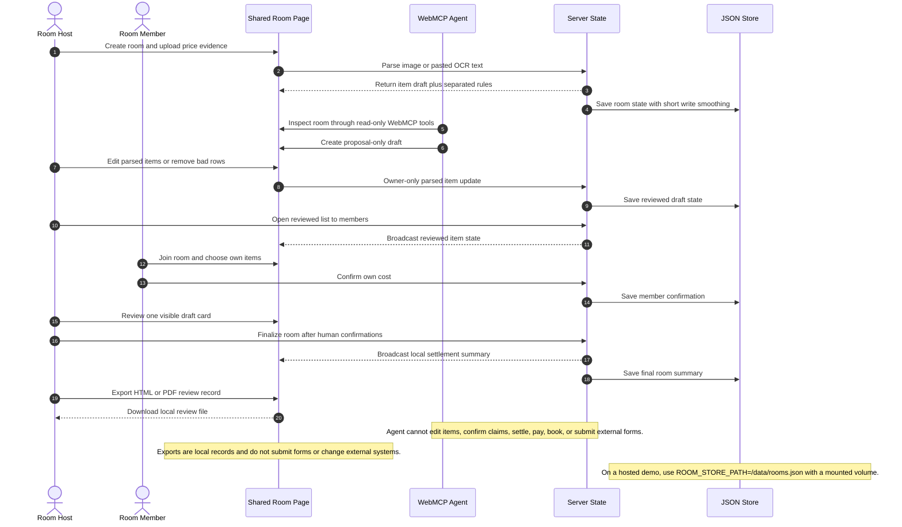
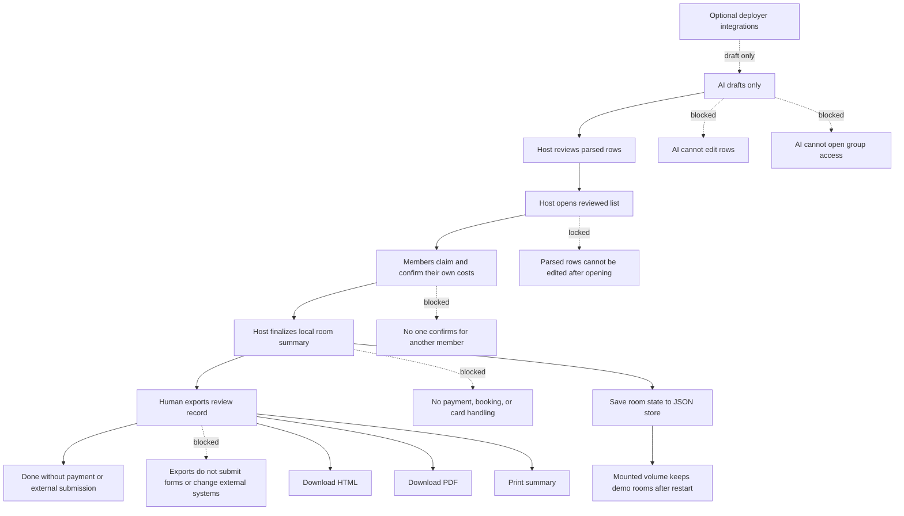
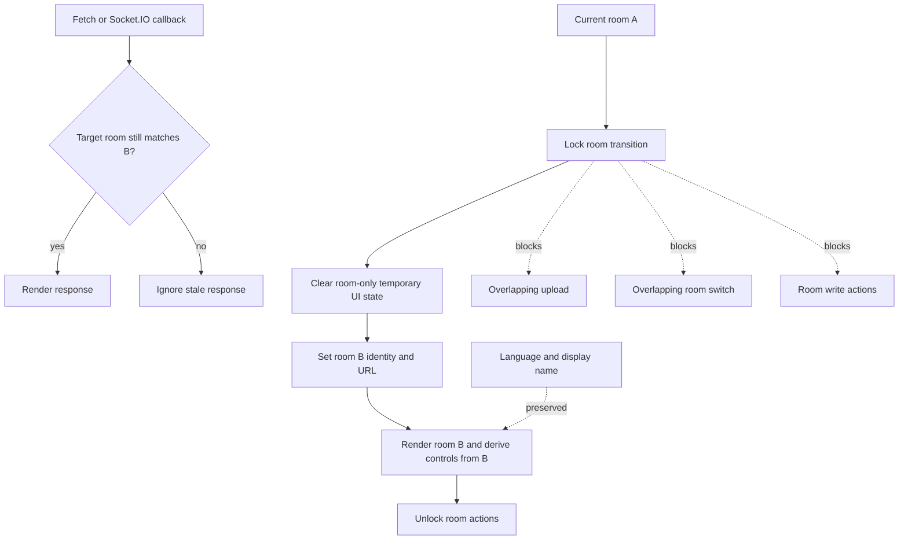
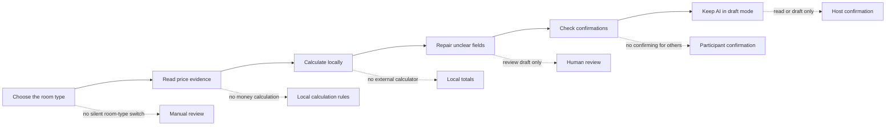
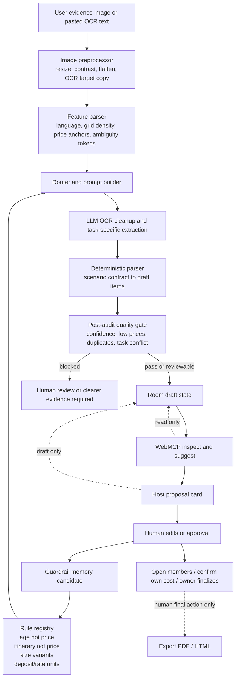
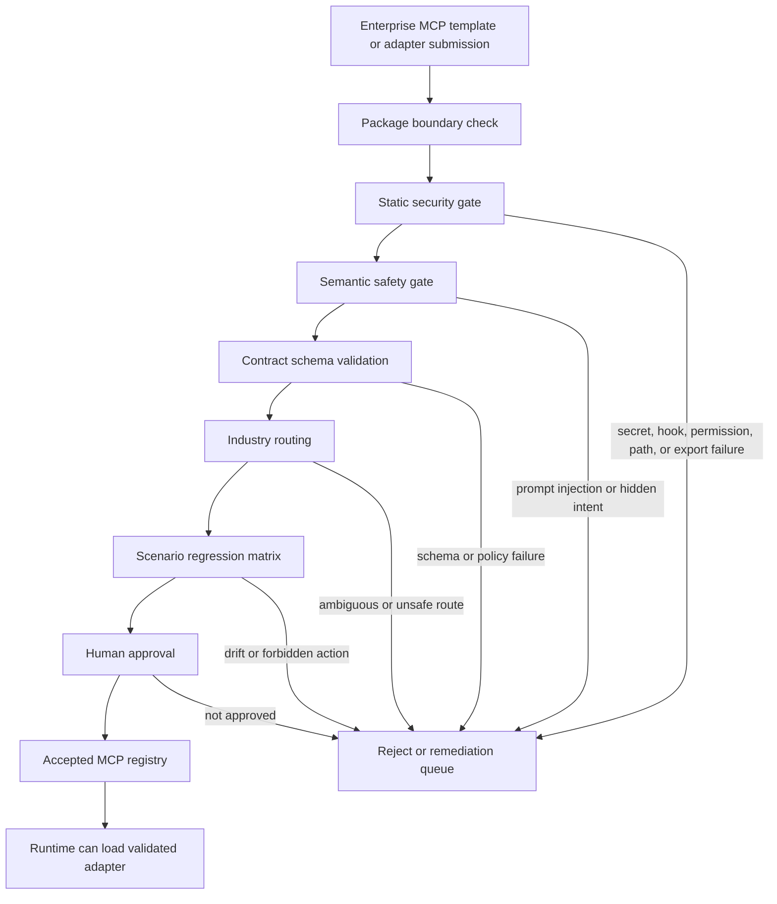
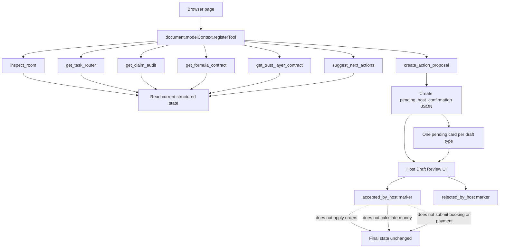
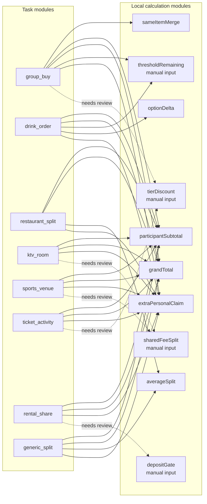
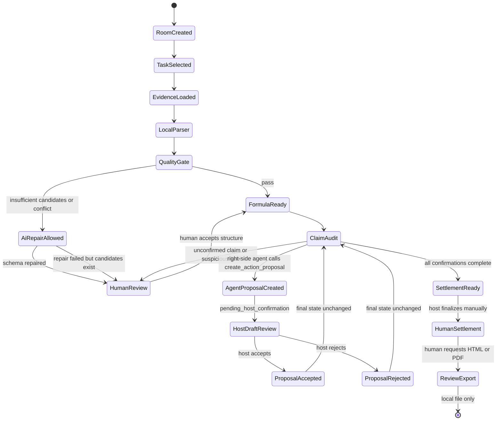
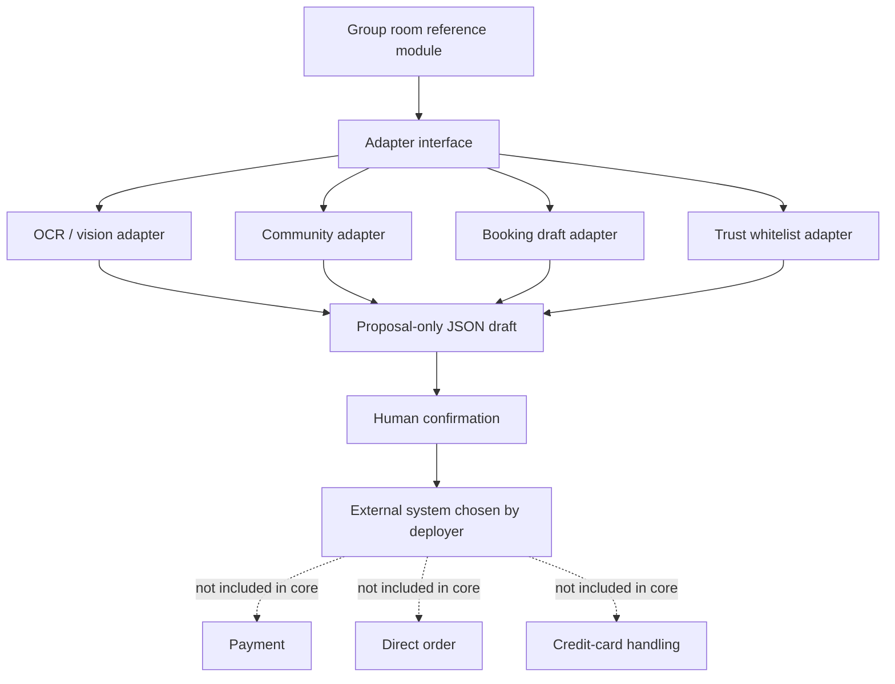

# Shared Room Mermaid Module Design

Generated at: 2026-09-01

Scope: open-source WebMCP tool-layer template for pre-payment social coordination.

WebMCP tool surface version: `group-room-webmcp-tools.v2`.

## Full Room Flow

## Permission Matrix

| role | inspect room | create proposal | edit parsed items | edit own claims | review proposal | settle |
|---|---:|---:|---:|---:|---:|---:|
| Anonymous viewer | yes | no | no | no | no | no |
| WebMCP agent | yes | proposal only | no | no | no | no |
| Room member | yes | no | no | own claims only | no | no |
| Room host | yes | yes | before member confirmation | own claims only | same-card human review | yes |
| Server | validates | stores limited drafts | checks room owner | checks each member only confirms themself | records review result | saves local room summary |

## Review Flow

## Room Transition Isolation

Room changes use one transition boundary for initial load, `New Room`, missing-room recovery, and same-room reset. Room-only upload previews, draft-review staging, source-image transforms, copied OCR text, and summary-tab state are cleared. User language and display-name preferences remain local to the browser.

## Fixed Review Steps

The implementation treats each handoff as a one-way step. A later step may stop and ask a human to review, but it may not silently rewrite an earlier step.

| importance | step | allowed actor | next state | rollback rule |
|---|---|---|---|---|
| required | AI/OCR evidence to draft items | server parser, proposal-only agent | host review | reload or reset room, not agent mutation |
| required | Host-reviewed items to group access | room host only | members may claim | parsed rows lock after opening |
| required | Member claims to confirmation | each member only | confirmed personal cost | member can unconfirm and edit own claim before settlement |
| required | Confirmations to final summary | room host only | settled room | no external payment or booking action |
| optional | External adapters to proposal | deployment owner adapter | pending host review | never applied silently |

## Six Safe Workflow Steps

## Adaptive OCR And LLM Review Loop

This loop is the adaptive parsing layer for messy menus, ticket tables, venue rates, rentals, activity signups, and screenshots. WebMCP stays as the room-state and draft-control interface. It does not become the final parser, calculator, claimant, or settlement authority.

### Scenario Contracts

| contract | examples | adaptive checks |
|---|---|---|
| `menu_size_option_matrix` | cafe menu, snacks, drinks | size labels become option groups; calories, ml, sugar, add-ons do not become base prices |
| `ticket_activity_matrix` | travel tickets, activity signup, admission table | itinerary numbers and age ranges stay as section/condition text; ticket rows use explicit price anchors |
| `venue_rate_matrix` | KTV, sports court, room rental | hours, people, sessions, and days are units; room or venue fees become claimable rows |
| `rental_deposit_key_value` | equipment rental, shared deposit | rent, deposit, cleaning fee, and damage fee remain distinct rows |
| `generic_price_evidence` | mixed screenshot or ad hoc split | uncertain rows are marked for human review instead of forced into a task module |

### Adaptive Refactor Files

| file | role |
|---|---|
| `config/scenario-contracts.json` | Declares supported scenario contracts, task type bindings, expected fields, guardrails, and prompt nodes. |
| `config/adaptive-prompt-library.json` | Stores reusable prompt nodes for OCR cleanup, ticket/activity extraction, menu size extraction, rate/deposit extraction, post-audit, WebMCP review, and host proposal boundaries. |
| `config/guardrail-registry.json` | Stores reusable known-error rules such as age numbers, itinerary numbers, capacity numbers, size variants, add-ons, and human final approval. |
| `fixtures/adaptive-parser-matrix.json` | Stores regression scenarios so new OCR failure modes can be added without changing test code. |

### Prompt Nodes

| node | responsibility | cannot do |
|---|---|---|
| Image preprocessor | prepare an OCR-friendly copy by resizing, flattening, and preserving text contrast | invent missing text or prices |
| OCR text cleanup | repair line breaks and align labels near prices | change a number without source evidence |
| Task-specific extraction | map rows into the selected scenario contract | switch the user-selected room type silently |
| Parser post-audit | flag low prices, duplicate labels, age/quantity/capacity confusion, and task conflicts | approve the draft |
| WebMCP inspect/suggest | read live room state, totals, warnings, confirmations, and next suggested action | edit items, claim for users, or settle |
| Host proposal gate | create one waiting-for-host draft card | open members, confirm costs, finalize, pay, book, or submit |

## Enterprise MCP Submit Gate

The enterprise submit gate is the future extension point for companies that want to submit MCP templates, adapters, prompt packs, or scenario contracts. The default is deny. A submitted package cannot be loaded, routed, executed, or promoted until the safety and contract gates pass.

### Enterprise Submit Architecture Table

| stage | owner | input | validation | blocks when | output evidence |
|---|---|---|---|---|---|
| `package_boundary` | submit gate | submitted bundle manifest, owner, version, entrypoints | manifest exists, export paths are bounded, no runtime output is included | missing manifest, unknown owner, unbounded export paths, runtime files in submission | package boundary report |
| `static_security_gate` | `ai-security-rules` | submitted repo or sanitized export bundle | read-only `scan`, `rules-check`, and `export-gate`; no `.env` reads, no command execution | critical/high finding, secret residue, over-privileged MCP config, install hook risk, unbounded filesystem/network scope | static scanner report path and remediation queue |
| `semantic_safety_gate` | `ai-security-rules` | prompts, tool descriptions, instructions, agent-readable files | read-only semantic review for prompt injection, hidden intent, jailbreak, and policy-bypass language | prompt injection, hidden intent, tool description policy bypass, indirect prompt injection risk | semantic safety report path |
| `contract_schema` | `shared-room-mcp` | scenario contracts, prompt library, guardrails, fixtures | JSON/schema consistency, known task types, known prompt nodes, known guardrails, human approval required | unknown task type, unknown guardrail, unknown prompt node, missing human approval, auto-finalize allowed | contract validation report |
| `industry_routing` | `shared-room-mcp` | validated contract plus feature profile | deterministic routing into menu, ticket/activity, venue, rental, group-buy, or generic evidence | no matching contract, high-risk ambiguity, category binding conflict | selected scenario contract and route rationale |
| `scenario_regression` | `shared-room-mcp` | fixture matrix and submitted adapter behavior | each line runs repeatedly; item count, prices, contract selection, forbidden numbers, and final-action boundaries must stay stable | price drift, item drift, contract drift, forbidden number leak, final action not human-controlled | repeat regression matrix |
| `human_review` | human operator | all gate evidence | operator reviews blocking reasons, residual warnings, and acceptance scope | missing evidence, unresolved high risk, operator rejection | signed approval decision |
| `accepted_registry` | registry maintainer | approved artifact only | versioned promotion, rollback identity, immutable evidence link | unapproved artifact, stale evidence, mismatched commit/package hash | accepted registry entry |

### Enterprise Governance Metadata

| group | required evidence |
|---|---|
| Provenance and integrity | SHA256, signing proof, source commit, builder identity |
| Permission and capability | declared tools, declared resources, network egress allowlist, filesystem scope |
| Data and privacy class | data classification, PII handling, retention policy |
| SBOM and dependency | CycloneDX SBOM, vulnerability report, package reputation evidence |
| Sandbox execution | isolation level, runtime network policy, runtime command policy |
| Human final-action | approval-required actions, final-action owner, human approval requirement |
| Lifecycle and revocation | revocation endpoint, sunset date, CVE contact, rollback identity |
| Review SLA and audit trail | review SLA, automated test evidence URL, audit log retention |

### Submit Gate Boundary Rules

| rule | reason |
|---|---|
| Safety scan runs before contract validation | A malicious MCP submission should not be parsed, routed, or loaded just because its business schema looks correct. |
| Runtime never loads unscanned MCP files | Hidden commands, overbroad filesystem scope, prompt-injection instructions, or install hooks must be blocked before runtime exposure. |
| Contract validation runs before industry routing | Routing only makes sense after fields, task types, prompt nodes, guardrails, and review policy are structurally valid. |
| Regression runs before human approval | Human review should inspect evidence, not guess whether the adapter drifts. |
| Human approval stays last | AI may recommend acceptance or rejection, but cannot promote a company template into the accepted registry. |

### Implementation Queue

| priority | item | status | next validation |
|---|---|---|---|
| P0 | File-based submit gate config | done in `config/enterprise-submit-gate.json` | `npm run verify:adaptive-contracts` |
| P0 | Contract/prompt/guardrail schema validation | done in `scripts/verify-adaptive-contracts.mjs` | JSON contract check |
| P0 | Multi-scenario repeat regression | done in `scripts/regression-adaptive-parser.mjs --repeat 5` | five-run stability matrix |
| P0 | AI review UI blocking reasons | done in `public/index.html` | frontend parse check plus manual smoke |
| P1 | Split security gate into static and semantic phases | done in `config/enterprise-submit-gate.json` | `npm run verify:adaptive-contracts` |
| P1 | Connect `ai-security-rules` report path into submit evidence | planned | scanner output fixture and gate parser |
| P1 | Accepted registry package format | planned | registry entry schema and rollback identity |
| P1 | Third-party adapter sandbox policy | described in gate config | disallow command execution and broad filesystem/network before approval |
| P2 | Web UI for enterprise submission review | planned | operator review screen with evidence links |
| P2 | Guardrail promotion workflow | planned | candidate-to-rule human approval test |

## WebMCP Tool Surface

## Room Type And Calculation Matrix

## State Machine

## Open-Source Extension Boundary

