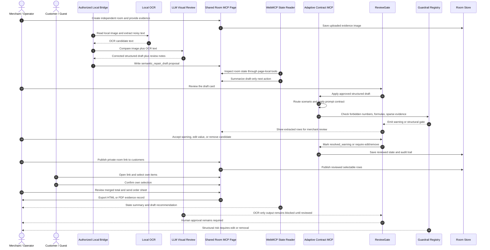
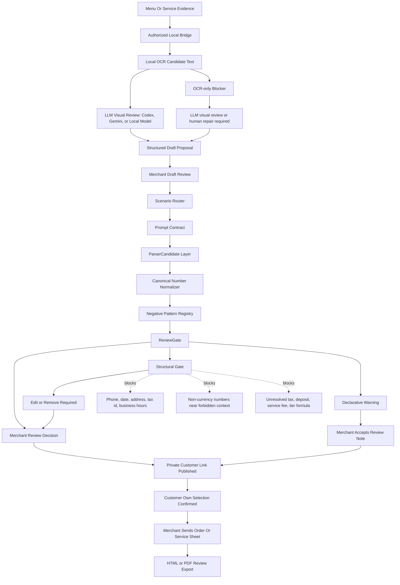

# Adaptive Contract MCP Architecture

Shared Room MCP is the reference application. Adaptive Contract MCP is the reusable contract, router, prompt, review-gate, and guardrail layer underneath it.

Adaptive Contract MCP is not a blockchain smart contract and not an autonomous execution engine. It means adaptive room terms drafted from evidence, validated by strict schemas, reviewed through WebMCP/Codex, and executed only after human approval.

The product boundary is a form-based async commercial intake room. It is not a chatroom, messaging app, payment gateway, booking bot, or browser-control agent. A cafe, restaurant, repair shop, clinic, salon, or local service provider can turn a physical menu, online menu, service list, or maintenance checklist into a private room link. Customers open that independent room on their own devices, choose their own items, see their own selections, and the merchant reviews the merged total before sending the order or service sheet. Payments and formal external orders stay outside this project.

OCR plus LLM visual review produces a structured draft. The LLM visual review node can be Codex, Gemini, or a deployment-owner local vision model. WebMCP/Codex reviews the room state and draft against the evidence. The human edits, confirms, overrides advisory warnings, and releases the commitment. Threshold conditions such as group size or minimum spend are warnings until a merchant decides; AI never commits a booking, group formation, payment, or final summary.

Zeabur is the hosted state storage, MCP protocol host, HITL approval gate, guardrail runtime, customer publishing surface, and export surface. Zero required ML/OCR workload is processed on the Zeabur server in the default WebMCP Challenge path.

WebMCP is the assistant-facing tool boundary, not the customer synchronization layer. The web runtime owns room creation, customer joins, selection updates, and totals. WebMCP exposes only the current room scope to the assistant for inspection and draft creation.

## Runtime Loop



## Node Permissions

| node | may read | may write | may not do |
|---|---|---|---|
| Local OCR | Local evidence image | No room state writes | Approve drafts, publish customer list, finalize, or call external services |
| LLM visual review: Codex, Gemini, or local model | Evidence image, OCR text, current room state when authorized | Structured draft and review notes only | Final approval, payment, booking, customer confirmation, or hidden item mutation |
| Authorized local bridge | Local OCR output, LLM review JSON, target room id, merchant participant id | One `semantic_repair_draft` proposal | Create final commitments, bypass merchant review, or expose private OCR reports in the repo |
| WebMCP page tools | Current browser room state | Proposal-only draft creation | Edit parsed items, approve drafts, publish items to customers, finalize, or export on behalf of the user |
| Zeabur room runtime | Uploaded evidence metadata, proposals, room state | Stores room state and applies an approved structured draft after merchant review | Run local OCR/LLM by default, charge payments, submit bookings, or auto-approve |
| Merchant or operator | Evidence, draft, customers, totals | Review decisions, item edits, customer publishing, final summary | Confirm another customer's selection |
| Customer | Published selectable items and own selection | Own quantity/options and own confirmation | Edit evidence, approve AI drafts, publish the list, or finalize |

## Contract Pipeline



## Semantic Visual Anchor

Adaptive Contract MCP currently uses Semantic Visual Anchors rather than pixel-level bounding boxes:

- `boundingZone`: a logical zone such as `header_top_right`, `footer_bottom`, or `table_row_3_col_2`.
- `auditAnchor`: a short surrounding text snippet that explains why the value was extracted or blocked.
- `detectedTypeHint`: a semantic hint such as `price_amount`, `phone_number`, `date`, `address_number`, `tax_identifier`, or `time_range`.
- `bbox`: reserved for future pixel-level crop overlays.

This is enough for the current demo because the merchant needs a stable review reason and source context, not a fragile crop coordinate that may drift after resizing.

## Guardrail Memory Rule

Guardrail memory stores negative patterns, not corrected answers.

Correct:

```json
{
  "patternScope": "CONTRACT_LOCAL",
  "matcherRule": {
    "type": "REGEX_CONTEXT",
    "regex": "(?i)(TEL|Phone|電話|电话|聯絡|地址|Addr|Tax ID|統編|營業時間)",
    "targetField": "SelectableItem.price"
  },
  "matcherStrength": "HARD_BLOCK",
  "actionOnMatch": "ROUTE_TO_REVIEW_GATE"
}
```

Incorrect:

```json
{
  "badAnswer": "2711 is never a price"
}
```

The first form prevents repeated known error patterns without poisoning future rooms with one historical answer.

## Public Benchmark Scope

The image matrix is a deterministic contract-driven integration benchmark. It verifies artifact integrity, scenario routing, schema adherence, customer-visible masks, anti-pollution gates, and HITL state transitions under paired image and evidence text.

It is not a provider accuracy benchmark and not a claim that arbitrary real-world images always parse correctly. The release claim is limited to deterministic image-plus-oracle integration, optional operator-machine OCR canaries, and the WebMCP plus Codex plus human-review loop. Zeabur is the hosted room/runtime/HITL surface; it is not the OCR engine unless a deployment owner explicitly installs and configures such an extension.
