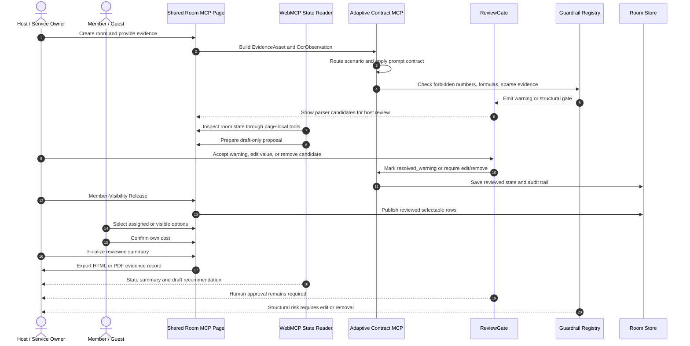
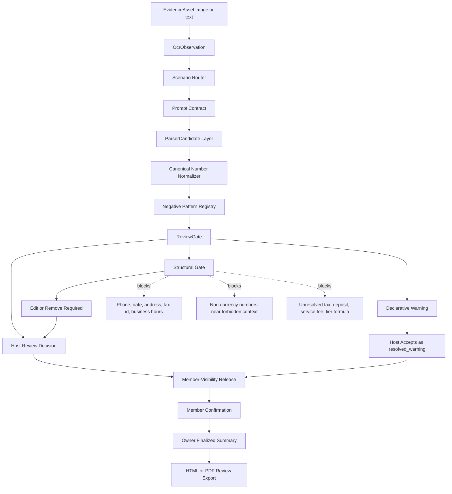

# Adaptive Contract MCP Architecture

Shared Room MCP is the reference application. Adaptive Contract MCP is the reusable contract, router, prompt, review-gate, and guardrail layer underneath it.

The product boundary is a form-based async private task room. It is not a chatroom, messaging app, payment gateway, booking bot, or browser-control agent. A host defines the evidence and service boundary; members fill only their own selectable or assigned parts; final release and settlement stay behind explicit human review.

## Runtime Loop



## Contract Pipeline



## Semantic Visual Anchor

Adaptive Contract MCP currently uses Semantic Visual Anchors rather than pixel-level bounding boxes:

- `boundingZone`: a logical zone such as `header_top_right`, `footer_bottom`, or `table_row_3_col_2`.
- `auditAnchor`: a short surrounding text snippet that explains why the value was extracted or blocked.
- `detectedTypeHint`: a semantic hint such as `price_amount`, `phone_number`, `date`, `address_number`, `tax_identifier`, or `time_range`.
- `bbox`: reserved for future pixel-level crop overlays.

This is enough for the current demo because the host needs a stable review reason and source context, not a fragile crop coordinate that may drift after resizing.

## Guardrail Memory Rule

Guardrail memory stores negative patterns, not corrected answers.

Correct:

```json
{
  "patternScope": "CONTRACT_LOCAL",
  "matcherRule": {
    "type": "REGEX_CONTEXT",
    "regex": "(?i)(TEL|Phone|電話|电话|聯絡|地址|Addr|Tax ID|統編|營業時間)",
    "targetField": "SelectableItem.price"
  },
  "matcherStrength": "HARD_BLOCK",
  "actionOnMatch": "ROUTE_TO_REVIEW_GATE"
}
```

Incorrect:

```json
{
  "badAnswer": "2711 is never a price"
}
```

The first form prevents repeated known error patterns without poisoning future rooms with one historical answer.

## Public Benchmark Scope

The image matrix is a deterministic contract-driven integration benchmark. It verifies artifact integrity, scenario routing, schema adherence, member-visible masks, anti-pollution gates, and HITL state transitions under paired image and oracle evidence.

It is not a provider accuracy benchmark and not a claim that arbitrary real-world images always parse correctly. The release claim is limited to deterministic image-plus-oracle integration and the WebMCP plus Codex plus human-review loop. External provider image-reading tests, if a deployment owner chooses to run them, are extension checks and not the Zeabur demo contract.
